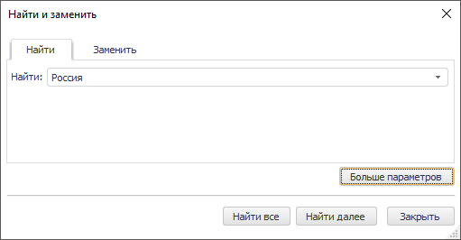
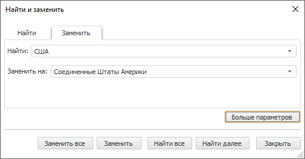

# Поиск и замена данных

Поиск и замена данных
-

# Поиск и замена данных

## Поиск данных

Если выделена одна ячейка, поиск данных распространяется на всю таблицу.
 Если выделен диапазон, поиск распространяется на выделенный диапазон ячеек.

Для поиска данных выполните следующие действия:

	- Откройте диалог «Найти и заменить».

[Для
 отображения диалога](javascript:TextPopup(this))

			- Щелкните по таблице данных.

			- Нажмите кнопку «Найти
			 и заменить»  на вкладке ленты «Таблица» или нажмите сочетание
			 клавиш CTRL+F.

	- В поле «Найти»
	 введите значения, формулы или текст для поиска в таблице.

	- Если необходимо, задайте дополнительные
	 параметры поиска. Для этого нажмите кнопку «Больше
	 параметров». На вкладке «Найти» появятся дополнительные настройки
	 поиска:

Примечание.
 Если параметры не задаются, по умолчанию поиск производится по всей рабочей
 книге по строкам, без учета формата искомых ячеек, регистра и других параметров.
 Поиск осуществляется по тексту в ячейках таблицы.

[Оформление
 ячеек с искомыми значениями](javascript:TextPopup(this))

	Примечание.
	 Настройка оформления доступна только в настольном приложении.

	Для выбора формата искомого значения
	 используйте раскрывающееся меню кнопки «Формат»,
	 содержащее следующие команды:

			- Задать формат.
			 Открывает стандартный [диалог форматирования](UiNav.Chm::/GUI/Format.htm),
			 в котором задается нужный формат. Заданный пользователем формат
			 отображается в поле «Образец».
			 Если формат не задан, в поле отображается текст «Формат
			 не задан»;

			- Выбрать формат из ячейки.
			 Скрывает диалог. После выделения ячейки отчета диалог отображается
			 снова, а в поле «Образец»
			 отображается формат выбранной ячейки;

			- Очистить формат поиска.
			 Сбрасывает выбранный формат. В поле «Образец»
			 отображается текст «Формат
			 не задан».

[Учитывать
 регистр](javascript:TextPopup(this))

	Чтобы при поиске учитывался регистр введенных
	 символов, установите флажок «Учитывать
	 регистр».

[Ячейка
 целиком](javascript:TextPopup(this))

	Чтобы находить только те ячейки, которые
	 полностью содержат значение, введенное для поиска, установите флажок
	 «Ячейки целиком».

[Порядок
 поиска](javascript:TextPopup(this))

	Для выбора порядка поиска используйте
	 раскрывающийся список «Порядок поиска»,
	 содержащий следующие значения:

			- по строкам;

			- по столбцам.

[Предмет
 поиска](javascript:TextPopup(this))

	Для выбора предмета поиска используйте
	 флажки:

			- Значение. Поиск
			 выполняется по значениям в ячейках;

			- Текст. Поиск
			 выполняется по тексту, отображаемому в ячейках. Отображаемый
			 текст может отличаться от значения ячейки из-за [настроек
			 формата отображаемых значений](../Workbook/UiDw_Series.htm#configure_format_of_displayed_values). Например, в ячейке может
			 содержаться значение «2,5879», а отображаться текст «2,59»;

			- Формула. Поиск
			 выполняется по формулам, по которым рассчитываются значения
			 в ячейках;

			- Метаданные.
			 Поиск выполняется по метаданным наблюдений в таблице. Для
			 вычисляемых элементов поиск выполняется по их формуле.

			Метаданные состоят из наименования источника данных и значений
			 обязательных атрибутов ряда, соответствующих наблюдению.

	Примечание.
	 Флажки «Формула» и «Метаданные» доступны только
	 в настольном приложении.

	- Нажмите на кнопку «Найти далее»
	 для последовательного перехода по найденным ячейкам таблицы или кнопку
	 «Найти все» для вывода всех
	 результатов поиска:

Совет. Для остановки
 процесса поиска нажмите клавишу ESC.

## Поиск и замена

Поиск и замена данных в таблице доступны только в настольном приложении.

Для поиска данных выполните следующие действия:

	- Откройте диалог «Найти и заменить»
	 на вкладке «Заменить».

[Для
 отображения диалога](javascript:TextPopup(this))

			- Щелкните по таблице данных.

			- Нажмите кнопку «Найти
			 и заменить»  на вкладке ленты «Таблица» или нажмите сочетание
			 клавиш CTRL+F.

	- В поле «Найти»
	 введите значения, формулы или текст для поиска в таблице.

	- В поле «Заменить
	 на» введите значения, формулы или текст, на которые нужно заменить
	 искомое значение в таблице.

	- Если необходимо, задайте [дополнительные
	 параметры поиска](UiDw_Object_Index_Search.htm#additional_search_parameters).

	- Нажмите на кнопку «Заменить»
	 для последовательной замены данных в ячейках таблицы или кнопку «Заменить все» для замены всех найденных
	 значений.

Совет. Для остановки
 процесса замены нажмите клавишу ESC.

См. также:

[Работа
 с таблицей данных](../Workbook/UiDw_Series.htm)

		Справочная
		 система на версию 10.9
		 от 18/08/2025,
		 © ООО «ФОРСАЙТ»,
