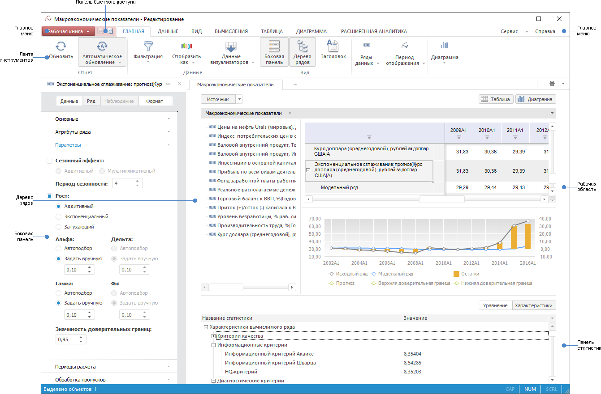

# Описание интерфейса

Описание интерфейса
-

# Описание интерфейса анализа временных
 рядов

Основное окно инструмента анализа временных рядов:

Окно состоит из:

	- главного меню. Содержит
	 основные команды для работы с базой данных временных рядов. Главное
	 меню состоит из подменю:

		- Рабочая книга. Используйте
		 для выполнения операций с рабочими книгами базы данных временных
		 рядов;

		- Сервис. Используйте
		 для [настройки параметров](TimeSeries_Setup.htm) инструмента
		 «Анализ временных рядов»;

		- Справка. Используйте
		 для работы со справочной системой продукта «Форсайт. Аналитическая платформа»;

	- ленты
	 инструментов. Содержит команды, размещенные на вкладках и упорядоченные
	 в логические группы. Каждая вкладка связана с видом выполняемого действия,
	 например, работа с таблицей данных или вычисляемыми рядами.

	Для получения информации о принципах и особенностях работы с лентой
	 инструментов обратитесь к разделу «[Настройка ленты инструментов](GetStarted.chm::/Interface/Interface_Description.htm#customize_ribbon)».

	- боковой панели. Содержит
	 вкладки, предназначенных для настройки параметров анализа временных
	 рядов. Вкладки объединены в группы: «Данные»,
	 «Ряд», «Наблюдение»,
	 «Формат», «Отметка»,
	 «Уравнение». Для отображения
	 требуемой группы используйте переключатели в верхней части панели.
	 Набор вкладок в группе зависит от типа объекта, с которым ведется
	 работа. Наименование и пиктограмма объекта отображаются в верхней
	 части панели.

	Для получения информации о принципах и особенностях работы с боковой
	 панелью обратитесь к разделу «[Настройка боковой панели](GetStarted.chm::/Interface/Interface_Description.htm#side_panel)».

Совет.
 Для того чтобы результаты изменения параметров объекта сразу отображались
 в [рабочей книге](../Workbook/UiDw_Workbook.htm) включите режим
 автоматического обновления. Для этого нажмите кнопку «Обновлять
 автоматически»  на вкладке
 ленты инструментов «Вид».

	- [рабочей
	 книги](../Workbook/UiDw_Workbook.htm). Основная функциональная область БД временных рядов,
	 предназначенная для работы с временными рядами данных.

См. также:

[Начало
 работы с инструментом «Анализ временных рядов»](../Getting_Started.htm)

		Справочная
		 система на версию 10.9
		 от 18/08/2025,
		 © ООО «ФОРСАЙТ»,
