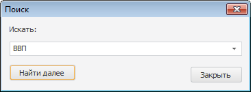
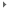
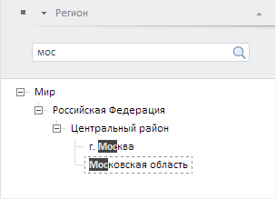

# Дерево рядов

Дерево рядов
-

**

# Дерево рядов

Дерево рядов отображает древовидную
 структуру элементов открытого источника данных. Структура дерева формируется
 на основании цепочки атрибутов, заданных в цепочке навигации. Уровни иерархии
 дерева отображаются в виде папок, названия которых соответствуют значениям
 атрибута. В дереве рядов доступна множественная отметка элементов при
 зажатой клавише SHIFT или CTRL.

Цепочка навигации расположена
 над деревом рядов. Работа с ней доступна после выбора источника данных.
 Порядок следования атрибутов, используемый по умолчанию, задается при
 [создании
 базы данных временных рядов](UiNavObj.chm::/TimeSeriesDatabase/TS_Attributes.htm#attr_order).

После изменения порядка атрибутов в цепочке навигации, иерархия дерева
 рядов перестраивается. Если в цепочке навигации отсутствуют выбранные
 атрибуты, то элементы отображаются в виде списка.

Пример дерева рядов:

Изменение порядка и состава атрибутов выполняется в цепочке навигации
 или с помощью группы вкладок «Отметка»,
 расположенной на боковой панели. Каждая вкладка соответствует атрибуту
 источника данных и содержит строку поиска и список значений атрибута.

[Для
 отображения группы вкладок](javascript:TextPopup(this))

		- Убедитесь, что боковая панель отображается.

		- Щелкните по дереву рядов.

		- Установите на боковой панели переключатель «Отметка».

	Например:

	

## Операции с деревом рядов

[Отображение/скрытие
 дерева рядов](javascript:TextPopup(this))

		- Перейдите на вкладку «Главная»
		 или «Вид» на ленте инструментов.

		- Нажмите кнопку 
		 «Дерево рядов».

	Для отображения/скрытия дерева рядов в настольном приложении также
	 можно использовать кнопку «Источник»,
	 расположенную над деревом рядов.

[Выбор
 источника данных](javascript:TextPopup(this))

	Лист рабочей книги может содержать ряды из различных источников
	 данных.

	В качестве источников доступны следующие объекты репозитория:

		- база данных временных рядов;

		- стандартный куб. Для использования куба должны выполняться
		 условия:

			- должен быть задан репозиторий НСИ, [используемый
			 по умолчанию](UiNav.chm::/02_Navigator/Repo_Default.htm). Данный репозиторий должен
			 содержать справочники [мер
			 и единиц измерения](UiNavObj.chm::/TimeSeriesDatabase/ChooseNSI.htm#measures), предназначенные для
			 использования в базах данных временных рядов;

			- куб должен удовлетворять условиям:

				- должен присутствовать только один факт с одним значением;

				- должна быть только одна таблица-источник с данными;

				- должно присутствовать хотя бы одно измерение;

				- в отношениях между измерениями отсутствуют формулы,
				 созданные с помощью языка Fore.

	Наименование выбранного источника данных отображается первым элементом
	 в цепочке навигации.

	Для выбора источника данных:

		- в
		 настольном приложении:

		-

			- Нажмите кнопку «Источник»,
			 расположенную над деревом рядов. Будет отображено дерево объектов
			 репозитория.

			- Выберите необходимый источник.

		- в
		 веб-приложении:

			- Перейдите на вкладку «Главная»
			 или «Вид» на ленте
			 инструментов.

			- Нажмите нижнюю часть кнопки  «Дерево рядов». Будет отображен
			 списков всех доступных источников данных.

			- Выберите необходимый источник.

	Дерево рядов и цепочка навигации будут перестроены в соответствии
	 с выбранным источником.

[Добавление
 нового источника данных](javascript:TextPopup(this))

		- В
		 настольном приложении:

		-

			- Вызовите раскрывающееся меню кнопки «Источник»,
			 расположенной над деревом рядов.

			- Нажмите кнопку «Импорт
			 данных».

		- В веб-приложении:

			- Перейдите на вкладку «Главная» на ленте инструментов.

			- Нажмите нижнюю часть кнопки
			  «Дерево
			 рядов». Будет отображен списков всех доступных источников
			 данных.

			- Нажмите кнопку «Импорт
			 данных».

	Будет открыт [мастер
	 импорта данных](UiNavObj.chm::/Data_import_wizard/Data_import_wizard.htm), с помощью которого создайте новый
	 источник данных.

## Операции с элементами дерева рядов

[Отображение/скрытие
 всплывающей подсказки](javascript:TextPopup(this))

		- Вызовите контекстное меню дерева рядов.

		- Установите/снимите флажок «Отображать
		 всплывающую подсказку». Если флажок установлен, то подсказка
		 отображается.

[Фильтрация
 элементов](javascript:TextPopup(this))

		- Вызовите контекстное меню дерева
		 рядов.

		- Выберите пункт «Скрывать».
		 Отобразится меню для настройки параметров фильтрации:

			- Нет фильтра.
			 Если переключатель установлен, то пустые элементы не фильтруются.
			 В дереве рядов отображаются пустые папки и не существующие,
			 но возможные элементы. Несуществующие элементы - это элементы,
			 получаемые разницей между декартовым произведением всех атрибутов,
			 отображаемых в дереве элементов, и существующими элементами;

			- Пустые ряды.
			 Если переключатель установлен, то в дереве рядов не отображаются
			 пустые ряды;

			- Пустые ряды и папки.
			 Если переключатель установлен, то в дереве рядов не отображаются
			 пустые ряды и папки. По умолчанию переключатель установлен.

	Дерево рядов будет перестроено с учётом заданной фильтрации.

	Примечание.
	 Какой ряд считать пустым зависит от флажка «Признак
	 пустого ряда» в [свойствах
	 БД временных рядов](UiNavObj.chm::/TimeSeriesDatabase/TS_Attributes.htm). По умолчанию флажок снят и
	 ряд считается пустым, если в БД временных рядов отсутствует ревизия,
	 содержащая информацию о данном ряде. Если флажок установлен, то ряд
	 считается пустым, если он не содержит данных.

[Поиск
 элементов](javascript:TextPopup(this))

	Примечание.
	 Возможность доступна только в настольном приложении. Поиск выполняется
	 только среди развернутых элементов, т.е. если есть группа элементов
	 и она свернута, то поиск внутри неё не выполняется.

	Для поиска элементов по наименованию:

		- выполните команду «Поиск»
		 в контекстном меню любого элемента;

		- щелкните по дереву рядов и нажмите сочетание клавиш CTRL+F.

	Будет открыт диалог «Поиск»:

	

	Введите наименование элемента и нажмите кнопку «Найти
	 далее». Первый найденный элемент будет выделен. Для поиска
	 следующего элемента, соответствующего условиям, повторно нажмите кнопку
	 «Найти далее».

	Если элемент с указанным наименованием не найден, то будет отображено
	 соответствующее сообщение.

## Операции с цепочкой навигации

[Быстрый
 выбор источника данных](javascript:TextPopup(this))

	Для быстрого выбора источника данных воспользуйтесь цепочкой навигации:

		- Щёлкните по наименования источника данных в цепочке навигации. Будет отображен список доступных источников
		 данных.

	Примечание.
	 В раскрывающемся списке содержатся источники данных, ранее [используемые](#add_ds)
	 на текущем листе рабочей книги. При переходе по листам рабочей книги
	 в список добавляются источники данных, используемые на других листах.
	 При [добавлении листа](../Workbook/UiDw_Woorkbook.htm#new_list)
	 в списке отображаются все источники данных, используемые в рабочей
	 книге.

		- Выберите необходимый источник данных.

	В результате:

		- будут перестроены цепочка навигации и дерево рядов в соответствии
		 с настройками нового источника данных;

		- в дереве источников репозитория в раскрывающемся меню кнопки
		 «Источники» отметка установится
		 на выбранном источнике данных.

[Вызов
 меню атрибута](javascript:TextPopup(this))

		- В настольном приложении.
		 Щелкните по наименованию атрибута в цепочке навигации.

		- В веб-приложении.
		 Нажмите кнопку , расположенную
		 после наименования атрибута в цепочке навигации.

	Будет открыто меню, содержащее команды для работы с атрибутом.

[Отображение
 списка доступных атрибутов](javascript:TextPopup(this))

		- В настольном
		 приложении. Нажмите кнопку ,
		 расположенную после наименования атрибута в цепочке навигации.
		 Будет отображен список доступных атрибутов.

		- В веб-приложении.
		 Вызовите меню атрибута. Будет открыто меню, содержащее список
		 доступных атрибутов и команд для работы с ними.

[Добавление
 атрибута в цепочку навигации](javascript:TextPopup(this))

		- Вызовите список доступных атрибутов и выберите требуемый
		 атрибут. В веб-приложении атрибуты, доступные для добавления,
		 объединены в группу «Добавить».

		Атрибут будет добавлен в цепочку навигации после кнопки .
		 Все последующие атрибуты будут удалены.

		- Используйте группу вкладок «Отметка»
		 на боковой панели. Переведите кнопку , соответствующую
		 атрибуту, в нажатое состояние.

		Атрибут будет добавлен в цепочку навигации в ту же позицию, в которой
		 он расположен на боковой панели.

[Замена
 атрибута в цепочке навигации](javascript:TextPopup(this))

		- Вызовите список доступных атрибутов.

		- Выберите требуемый атрибут. В веб-приложении атрибуты, доступные
		 для замены объединены в группу «Заменить».

	Атрибут будет помещён в цепочку навигации вместо атрибута, меню
	 которого было вызвано. Порядок и состав прочих атрибутов не меняется.

[Удаление
 атрибута из цепочки навигации](javascript:TextPopup(this))

		- Вызовите меню атрибута и выполните команду «Удалить».

		- Используйте группу вкладок «Отметка»
		 на боковой панели. Переведите кнопку , соответствующую
		 атрибуту, в ненажатое состояние.

	Атрибут будет удалён из цепочки навигации.

[Очистка
 цепочки навигации](javascript:TextPopup(this))

		- Вызовите меню атрибута.

		- Выполните команду «Очистить
		 цепочку».

	Все атрибуты из цепочки навигации будут удалены.

[Изменение
 порядка следования атрибута в цепочке навигации](javascript:TextPopup(this))

	Изменение порядка следования атрибута доступно:

		- с помощью группы вкладок «Отметка»
		 на боковой панели. Нажмите кнопку , соответствующую
		 атрибуту. Будет отображено меню:

		-

			- вверх. Перемещает
			 вкладку на одну позицию вверх. Атрибут, соответствующий вкладке,
			 будет перемещен в цепочке навигации на одну позицию влево;

			- вниз. Перемещает
			 вкладку на одну позицию вниз. Атрибут, соответствующий вкладке,
			 будет перемещен в цепочке навигации на одну позицию вправо;

		- с помощью команд в меню атрибута в настольном приложении:

		-

			- вправо. Перемещает
			 атрибут на одну позицию вправо;

			- влево. Перемещает
			 атрибут на одну позицию влево.

[Настройка
 последовательности атрибутов по умолчанию](javascript:TextPopup(this))

	Для настройки последовательности атрибутов по умолчанию:

		- Нажмите кнопку ,
		 расположенную после корневого элемента в цепочке навигации.

		- Выполните команду «Порядок
		 по умолчанию».

	Будет восстановлена последовательность обязательных атрибутов, установленная
	 по умолчанию.

[Просмотр
 значений атрибута](javascript:TextPopup(this))

		- Используйте группу вкладок «Отметка»
		 на боковой панели. Щелкните по названию вкладки, соответствующей
		 атрибуту.

		- В веб-приложении щелкните по названию атрибута в цепочке
		 навигации.

	Будет отображен иерархический список со значениями атрибута.

	Для разворачивания/сворачивания иерархии используйте команды в контекстном
	 меню списка: «Развернуть всё»
	 и «Свернуть всё».

[Сортировка
 значений атрибута](javascript:TextPopup(this))

	Для быстрой сортировки:

		- нажмите кнопку ;

		- выберите пункт «Сортировка».
		 Отобразится подменю для установки порядка сортировки значений
		 атрибутов;

		- установите переключатель, определяющий направление сортировки.
		 По умолчанию сортировка не выполняется.

	Порядок элементов будет изменён в соответствии с выбранным направлением
	 сортировки.

	Примечание.
	 Быстрая сортировка доступа только в веб-приложении.

	Для расширенной сортировки:

		- В настольном приложении вызовите
		 меню атрибута. В веб-приложении вызовите контекстное меню списка
		 значений атрибута.

		- Выберите пункт «Сортировка».
		 Отобразится подменю:

			- Применить из источника.
			 Для сортировки значений атрибута используются параметры, заданные
			 для исходного измерения;

	Примечание.
	 Команда доступна только в веб-приложении.

		-

			- По возрастанию.
			 Сортировка выполняется по возрастанию значений атрибута, выбранного
			 в списке атрибутов измерения;

			- По убыванию.
			 Сортировка выполняется по убыванию значения атрибута, выбранного
			 в списке атрибутов измерения;

	Примечание.
	 Если атрибут изменения не задан, сортировка выполняется по первому
	 атрибуту в списке.

		-

			- Список атрибутов измерения.
			 Список содержит все атрибуты исходного измерения. Установите
			 переключатель напротив атрибута, по значениям которого выполняется
			 сортировка.

			Если до выбора атрибута направление сортировки не задано, то
			 выполняется сортировка по возрастанию значений.

	Порядок элементов будет изменён в соответствии с заданными параметрами
	 сортировки.

[Фильтрация
 дерева рядов по значениям атрибута](javascript:TextPopup(this))

	Фильтрация выполняется с помощью:

		- цепочки навигации. Установите флажок «Фильтрация»
		 в меню атрибута и задайте фильтр;

		- вкладок «Отметка»
		 на боковой панели. Перейдите на вкладку, соответствующую требуемому
		 атрибуту и задайте фильтр.

	Фильтр формируется по отметке значений атрибутов. Для работы с отметкой
	 используйте команды контекстного меню списка значений атрибута:

		- Отметить всё**. Устанавливает
		 отметку для всех элементов;

		- Снять отметку со всех.
		 Снимает отметку со всех элементов;

		- Отметить все подчинённые.
		 Устанавливает отметку для выбранного элемента и всех его дочерних
		 элементов;

		- Снять отметку с подчинённых.
		 Снимает отметку для выбранного элемента и со всех его дочерних
		 элементов.

		- Расширенная отметка:

			- Отметить уровень.
			 Устанавливает отметку для всех элементов, расположенных на
			 одном уровне с указанным элементом, уровень можно выбрать
			 из раскрывающегося списка;

			- Снять отметку с уровня.
			 Снимает отметку со всех элементов, расположенных на одном
			 уровне с указанным элементом, уровень можно выбрать из раскрывающегося
			 списка;

			- Применить схему отметки.
			 Автоматически применяет выбранную [схему
			 отметки](UiNavObj.chm::/reference_book/look-and-feel_Reference_book/UiMd_reference_book_look-and-feel_Scheme.htm) при любом изменении отметки. Для
			 отключения применения выберите пункт «Сбросить»;

			- Отметить группу.
			 Снимает текущую отметку и отмечает элементы, входящие в [группу элементов](UiNavObj.chm::/reference_book/look-and-feel_Reference_book/UiMd_reference_book_look-and-feel_Group.htm);

			- Отметить иерархию.
			 Снимает текущую отметку и отмечает элементы, входящие в [альтернативную
			 иерархию](UiNavObj.chm::/reference_book/UiMd_reference_book_Hierarchy.htm).

	Данные об отметке отображаются в круглых скобках после наименования
	 атрибута в цепочке навигации.

[Поиск
 значений атрибута](javascript:TextPopup(this))

	Используйте группу вкладок «Отметка»
	 на боковой панели:

		- Перейдите на вкладку, соответствующую требуемому атрибуту.

		- Введите искомое значение в строку поиска, расположенную
		 в верхней части вкладки. В списке элементов измерения останутся
		 лишь элементы, соответствующие условиям поиска.

	Примечание.
	 Для выполнения поиска в веб-приложении нажмите кнопку .

	Например:

	

[Изменение
 наименования элементов в списке значений атрибута](javascript:TextPopup(this))

		- Вызовите контекстное меню списка
		 значений атрибута.

		- Выберите пункт «Наименования».
		 Отобразится подменю:

		-

			- По умолчанию.
			 Список содержит значения атрибута, используемого по умолчанию
			 для формирования наименования элементов в исходном измерении;

			- Список атрибутов измерения.
			 Список содержит все атрибуты исходного измерения. Установите
			 переключатель напротив атрибута, значения которого должны
			 отображаться в списке.

	Наименования элементов в списке будут изменены в соответствии с
	 заданными параметрами.

[Настройка
 отображения элементов в списке значений атрибута](javascript:TextPopup(this))

	Настройка списка отображаемых элементов доступна при использовании
	 «[Группы элементов](UiNavObj.chm::/reference_book/look-and-feel_Reference_book/UiMd_reference_book_look-and-feel_Group.htm)»
	 или «[Альтернативной иерархии](UiNavObj.chm::/reference_book/UiMd_reference_book_Hierarchy.htm)».

	Вызовите контекстное меню списка значений атрибута и выберите один
	 из пунктов в группе команд «Вид»:

		- Группа элементов.
		 Отображает в списке только элементы выбранной группы элементов.

		- Альтернативная иерархия. Отображает
		 в списке только элементы выбранной альтернативной иерархии.

	Для возврата ко всему списку элементов, выберите пункт «Сбросить».

См. также:

[Рабочая
 книга](../Workbook/UiDw_Workbook.htm)

		Справочная
		 система на версию 10.9
		 от 18/08/2025,
		 © ООО «ФОРСАЙТ»,
