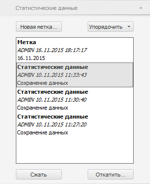
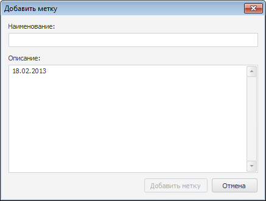
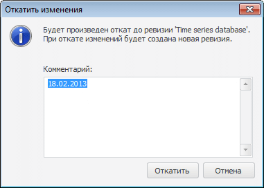

# Работа с версиями данных

Работа с версиями данных
-

# Работа с версиями данных

База данных временных рядов, которая хранит информацию обо всех изменениях
 временных рядов, называется версионной.

Совет. Как узнать,
 является ли база данных временных рядов версионной?

База данных временных рядов является версионной, если в её свойствах на
 странице «[Атрибуты](UiNavObj.chm::/TimeSeriesDatabase/TS_Attributes.htm)»
 установлен флажок «Вести историю изменений».
 По умолчанию флажок установлен, изменение значения флажка доступно только
 при создании базы данных временных рядов.

Для работы с версиями данных предназначены:

	- ревизии. Создаются автоматически
	 и предназначены для хранения информации об изменениях временных рядов:
	 изменение значений атрибутов, изменение значений наблюдений;

	- метки. Создаются пользователем
	 и предназначены для создания копии данных всех временных рядов на
	 текущий момент. Данные копируются на момент создания метки. В дальнейшем
	 данные временных рядов могут изменяться, а копия данных, зафиксированная
	 меткой, остается без изменений.

	Таким образом, метка создается, если требуется сделать копию данных
	 по состоянию на определенную дату, например, на начало месяца или
	 перед началом сложных изменений, которые могут внести ошибки в данные.
	 В дальнейшем это позволит вернуть данные по состоянию на дату создания
	 метки с помощью отката изменений.

Для просмотра информации о существующих ревизиях и метках используйте
 вкладки на боковой панели. Наименование вкладки совпадает с наименованием
 источника данных рабочей книги.

[Для отображения
 вкладки](javascript:TextPopup(this))

		- Убедитесь, что боковая панель отображается.

		- Перейдите в группу вкладок «Данные».

		- Перейдите на вкладку, наименование которой совпадает с наименование
		 источника данных.

Для каждой ревизии и метки отображаются: название, имя создателя, дата
 создания и описание. Например:

Операции с метками и ревизиями:

[Изменения
 порядка сортировки](javascript:TextPopup(this))

	Нажмите кнопку «Упорядочить»
	 и в раскрывающемся меню кнопки укажите порядок сортировки:

		- по наименованию.
		 Сортировка по наименованию. Выполняется по возрастанию;

		- по дате. Используется
		 по умолчанию. Сортировка по дате создания. Выполняется по убыванию.

	Список меток и ревизий будет перестроен с учётом порядка сортировки.

[Создание
 новой метки](javascript:TextPopup(this))

	Нажмите кнопку «Новая метка».
	 Будет отображен диалог «Добавить
	 метку»:

	

	Задайте наименование и описание создаваемой метки.

[Сжатие
 ревизий](javascript:TextPopup(this))

	При использовании БД временных рядов в течение длительного времени
	 утрачивается необходимость хранить данные по всем ревизиям. Количество
	 хранимых ревизий можно уменьшить путем сжатия нескольких ревизий в
	 одну. Сжатие выполняется от выбранной до первой созданной ревизии.

	Для сжатия ревизий:

		- Выделите ревизию, до которой будет выполняться сжатие.

		- Нажмите кнопку «Сжать».

	Все ревизии: от первой созданной до выбранной, - будут сжаты. Если
	 среди сжимаемых ревизий есть метки, то будет предложено их сохранить.

[Откат
 изменений](javascript:TextPopup(this))

	Для поиска и устранения ошибок доступно откатить изменения, т.е. вернуть
	 данные по состоянию на определенную ревизию.

	Для отката изменений:

		- Выберите ревизию, на данные которой требуется выполнить
		 откат.

		- Нажмите кнопку «Откатить».
		 Будет открыт диалог «Откатить
		 изменения», в котором укажите комментарий к выполняемому
		 действию:

	

	Изменения в данных до выбранной ревизии будут отменены. Для фиксации
	 данного действия создается новая ревизия.

См. также:

[Создание
 БД временных рядов](UiNavObj.chm::/TimeSeriesDatabase/CreateTimeSeriesDatabase.htm)

		Справочная
		 система на версию 10.9
		 от 18/08/2025,
		 © ООО «ФОРСАЙТ»,
