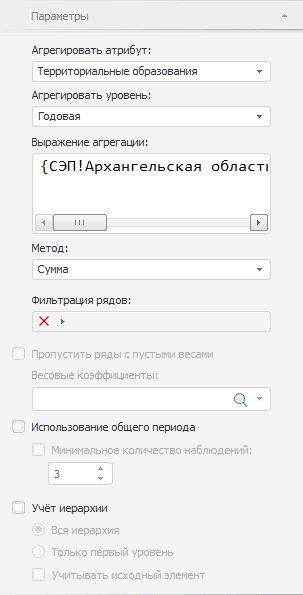

# Настройка базовых параметров агрегации по показателям

Настройка базовых параметров агрегации по показателям
-

# Настройка базовых параметров агрегации по показателям

Для настройки базовых параметров агрегации по показателям используйте
 вкладку «Параметры» на боковой
 панели.

[Для отображения
 вкладки](javascript:TextPopup(this))

		- Убедитесь, что боковая панель отображается.

		- Выделите в таблице данных ряд, рассчитанный методом «Агрегация по показателям».

		- Установите переключатель «Ряд»
		 на боковой панели.

		- Перейдите на вкладку «Параметры».

Параметры на вкладке соответствуют параметрам диалога «[Агрегация](UiDw_cs_Aggregation.htm)», отображаемого
 при создании вычисляемого ряда.

См. также:

[Работа с вычисляемыми рядами](../../UiDw_ComputedSeries.htm)
 | [Агрегация
 по показателям](UiDw_cs_Aggregation.htm)

		Справочная
		 система на версию 10.9
		 от 18/08/2025,
		 © ООО «ФОРСАЙТ»,
