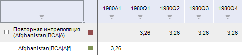
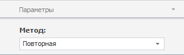

# Интерполяция по времени

Интерполяция по времени
-

# Интерполяция по времени

Интерполяция - это расчёт данных нижнего уровня на основе данных верхнего
 уровня. Например, квартальные данные необходимо распределить по месяцам.
 В модуле анализа временных рядов доступны следующие методы интерполяции:

	- Интерполяция по времени (пропорциональная).
	 Дезагрегирует данные с применением пропорциональной интерполяции;

	- Интерполяция по времени (повторная). Дезагрегирует
	 данные путем повторения значений динамики исходного ряда.

Методы входят в группу «Агрегация».

[Для применения
 метода](javascript:TextPopup(this))

		- Выделите один или несколько рядов в таблице данных;

		- Выполните соответствующую команду в раскрывающемся меню
		 кнопки «Агрегация»  на вкладке ленты «Вычисления».

После применения метода будет отображен диалог «Параметры»,
 предназначенный для выбора входной динамики.

Динамика может быть выходной, если она меньше динамики временного ряда,
 для которого применяется метод. Например, интерполяция рассчитывается
 для ряда с квартальной динамикой. Таким образом, в раскрывающемся списке
 «Выходная динамика» будут доступны
 варианты «Дневная» и «Месячная».

Укажите выходную динамику вычисляемого ряда. Если не существует динамик,
 которые могут быть выходными, то будет отображено соответствующее сообщение.

После выбора выходной динамики в рабочей книге на основе каждого
 выделенного ряда будет создан вычисляемый ряд с наименованием вида «<Наименование_функции>(<Имя_Ряда>)»,
 содержащий результаты расчета. Например:

## Настройка параметров расчёта. Вкладка «Параметры»

Для изменения метода расчёта интерполяции используйте вкладку «Параметры» на боковой панели.

[Для отображения
 вкладки](javascript:TextPopup(this))

		- Убедитесь, что боковая панель отображается;

		- Выделите в таблице данных ряд, рассчитанный методом «Интерполяция по времени»;

		- Установите переключатель «Ряд»
		 на боковой панели;

		- Перейдите на вкладку «Параметры».

В раскрывающемся списке «Метод»
 выберите требуемый метод расчёта интерполяции по времени.

См. также:

[Работа
 с вычисляемыми рядами](../../UiDw_ComputedSeries.htm) | [Методы
 интерполяции](Lib.chm::/03_Transformations/UiModelling_Interpolation.htm) |Контейнер моделирования: модель
 «[Интерполяция](UiModelling.chm::/2_Container_of_Modeling/2_3_Work_object/2_3_2_Model/Specification/UiModelling_Specification_Interpolation.htm)» |
 [IModelling.Interpolate](KeMs.chm::/Interface/IModelling/IModelling.Interpolate.htm)
 | [IModelling.InterpolateP](KeMs.chm::/Interface/IModelling/IModelling.InterpolateP.htm)

		Справочная
		 система на версию 10.9
		 от 18/08/2025,
		 © ООО «ФОРСАЙТ»,
