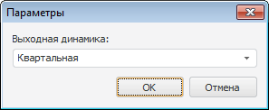
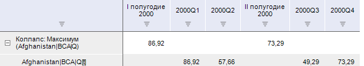
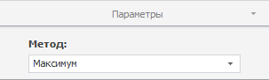

# Агрегация по времени

Агрегация по времени
-

# Агрегация по времени

Агрегация - это расчёт данных
 верхнего уровня на основе данных нижнего уровня. Например, данные, рассчитанные
 по месяцам, суммируются для получения квартальных данных. В инструменте
 анализа временных рядов доступны следующие методы агрегации:

	- Агрегация по времени (максимум). Агрегирует
	 данные путем нахождения максимального значения элементов динамики;

	- Агрегация по времени (минимум). Агрегирует
	 данные путем нахождения минимального значения элементов динамики;

	- Агрегация по времени (первый
	 элемент). Агрегирует данные путем нахождения первого имеющегося
	 значения элементов динамики;

	- Агрегация по времени (последний
	 элемент). Агрегирует данные путем нахождения последнего
	 имеющегося значения элементов динамики;

	- Агрегация по времени (среднее). Агрегирует
	 данные путем нахождения среднего значения элементов динамики;

	- Агрегация по времени (стандартное
	 отклонение). Агрегирует данные путем нахождения стандартного
	 отклонения по динамике. Стандартное отклонение - это мера того, насколько
	 широко разбросаны значения элементов относительно их среднего;

	- Агрегация по времени (сумма).
	 Агрегирует данные путем суммирования значений элементов динамики.

Методы входят в группу «Агрегация».

[Для применения
 метода](javascript:TextPopup(this))

		- Выделите один или несколько рядов в таблице данных.

		- Выполните соответствующую команду в раскрывающемся меню
		 кнопки  «Агрегация»
		 на вкладке «Вычисления»
		 ленты инструментов.

После применения метода будет отображен диалог «Параметры»,
 предназначенный для выбора выходной динамики.

Динамика может быть выходной, если она больше динамики временного ряда,
 для которого применяется метод. Например, агрегация рассчитывается для
 ряда с квартальной динамикой. Таким образом, в раскрывающемся списке «Выходная динамика» будут доступны
 варианты «Годовая» и «Полугодовая».

Укажите выходную динамику вычисляемого ряда. Если не существует динамик,
 которые могут быть выходными, то будет отображено соответствующее сообщение.

После выбора выходной динамики в рабочей книге на основе каждого
 выделенного ряда будет создан вычисляемый ряд с наименованием вида «Коллапс: <Тип_агрегации>(<Имя_Ряда>)»,
 содержащий результаты расчета. Например:

## Настройка параметров расчёта. Вкладка «Параметры»

Для изменения метода расчёта агрегации используйте вкладку «Параметры»
 на боковой панели.

[Для отображения
 вкладки](javascript:TextPopup(this))

		- Убедитесь, что боковая панель отображается.

		- Выделите в таблице данных ряд, рассчитанный методом «Агрегация по времени».

		- Установите переключатель «Ряд»
		 на боковой панели.

		- Перейдите на вкладку «Параметры».

В раскрывающемся списке «Метод»
 выберите требуемый метод расчёта агрегации по времени.

См. также:

[Работа
 с вычисляемыми рядами](../../UiDw_ComputedSeries.htm) | Контейнер
 моделирования: [Коллапс
 (векторный расчет)](UiModelling.chm::/2_Container_of_Modeling/2_3_Work_object/2_3_2_Model/Specification/UiModelling_Specification_Collaps.htm),
 [Коллапс
 (поточечный расчет)](UiModelling.chm::/2_Container_of_Modeling/2_3_Work_object/2_3_2_Model/Specification/UiModelling_Specification_Collaps_point.htm) | [IModelling.Collapse](KeMs.chm::/Interface/IModelling/IModelling.Collapse.htm)

		Справочная
		 система на версию 10.9
		 от 18/08/2025,
		 © ООО «ФОРСАЙТ»,
