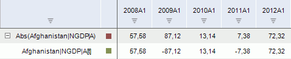

# Абсолютное значение

Абсолютное значение
-

# Абсолютное значение

Метод «Абсолютное значение»
 вычисляет абсолютные значения ряда. Входит в группу арифметических методов.

[Для применения
 метода](javascript:TextPopup(this))

		- Выделите один или несколько рядов в таблице данных;

		- Выполните команду «Абсолютное
		 значение» в раскрывающемся меню кнопки «Арифметика»
		  на вкладке ленты «Вычисления».

После применения метода в рабочей книге на основе каждого выделенного
 ряда будет создан вычисляемый ряд с наименованием вида «Abs(<Имя_Ряда>)»,
 содержащий результаты расчета. Например:

См. также:

[Работа
 с вычисляемыми рядами](../../UiDw_ComputedSeries.htm) | [IModelling.Abs](KeMs.chm::/Interface/IModelling/IModelling.Abs.htm)
 | [IModelling.Absi](KeMs.chm::/Interface/IModelling/IModelling.Absi.htm)

		Справочная
		 система на версию 10.9
		 от 18/08/2025,
		 © ООО «ФОРСАЙТ»,
