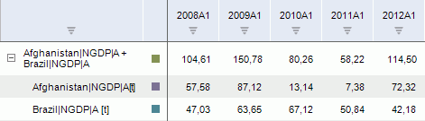

# Сложение

Сложение
-

# Сложение

Метод «Сложение» вычисляет
 результат сложения двух и более рядов. Входит в группу арифметических
 методов.

[Для применения
 метода](javascript:TextPopup(this))

		- Выделите несколько рядов в таблице данных;

		- Выполните команду «Сложение»
		 в раскрывающемся меню кнопки «Арифметика»
		  на вкладке ленты «Вычисления».

После применения метода в рабочей книге на основе выделенных рядов будет
 создан вычисляемый ряд с наименованием вида «<Имя_Ряда_1>+<Имя_Ряда_2>+...+<Имя_Ряда_n>»,
 содержащий результаты расчета. Например:

См. также:

[Работа
 с вычисляемыми рядами](../../UiDw_ComputedSeries.htm) | [IModelling.Sum](KeMs.chm::/Interface/IModelling/IModelling.Sum.htm)
 | [IModelling.Sumi](KeMs.chm::/Interface/IModelling/IModelling.Sumi.htm)

		Справочная
		 система на версию 10.9
		 от 18/08/2025,
		 © ООО «ФОРСАЙТ»,
