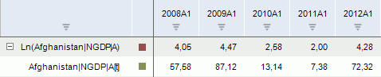

# Натуральный логарифм

Натуральный логарифм
-

# Натуральный логарифм

Метод «Натуральный логарифм»
 вычисляет натуральный логарифм ряда: Ln(X[t]).
 Входит в группу арифметических методов.

Примечание.
 Натуральный логарифм может быть рассчитан только для значений ряда, находящихся
 в диапазоне (0,∞).

[Для применения
 метода](javascript:TextPopup(this))

		- Выделите один или несколько рядов в таблице данных;

		- Выполните команду «Натуральный
		 логарифм» в раскрывающемся меню кнопки «Арифметика»
		  на вкладке ленты «Вычисления».

После применения метода в рабочей книге на основе каждого выделенного
 ряда будет создан вычисляемый ряд с наименованием вида «Ln(<Имя_Ряда>)»,
 содержащий результаты расчета. Например:

См. также:

[Работа
 с вычисляемыми рядами](../../UiDw_ComputedSeries.htm) | Контейнер
 моделирования: [Преобразования
 над переменными или факторами](UiModelling.chm::/2_Container_of_Modeling/2_3_Work_object/UiModelling_work_Changes.htm) | [IModelling.Ln](KeMs.chm::/Interface/IModelling/IModelling.Ln.htm)

		Справочная
		 система на версию 10.9
		 от 18/08/2025,
		 © ООО «ФОРСАЙТ»,
