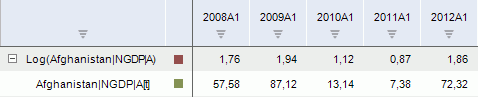
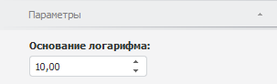

# Логарифм

Логарифм
-

# Логарифм

Метод «Логарифм» вычисляет
 логарифм ряда по заданному основанию: Log(X[t]).
 Входит в группу арифметических методов.

Примечание.
 Логарифм может быть рассчитан только для значений ряда, находящихся в
 диапазоне (0,∞).

[Для применения
 метода](javascript:TextPopup(this))

		- Выделите один или несколько рядов в таблице данных;

		- Выполните команду «Логарифм»
		 в раскрывающемся меню кнопки «Арифметика»
		  на вкладке ленты «Вычисления».

После применения метода в рабочей книге на основе каждого выделенного
 ряда будет создан вычисляемый ряд с наименованием вида «Log(<Имя_Ряда>)»,
 содержащий результаты расчета. Например:

## Настройка параметров расчёта. Вкладка «Параметры»

Для настройки параметров расчёта используйте вкладку «Параметры»
 на боковой панели.

[Для отображения
 вкладки](javascript:TextPopup(this))

		- Убедитесь, что боковая панель отображается;

		- Выделите в таблице данных ряд, рассчитанный методом «Логарифм»;

		- Установите переключатель «Ряд»
		 на боковой панели;

		- Перейдите на вкладку «Параметры».

В поле «Основание логарифма»
 укажите значение основания логарифма. Основание логарифма может принимать
 только положительные значения. По умолчанию основание логарифма равняется
 десяти.

См. также:

[Работа
 с вычисляемыми рядами](../../UiDw_ComputedSeries.htm) | Контейнер
 моделирования: [Преобразования
 над переменными или факторами](UiModelling.chm::/2_Container_of_Modeling/2_3_Work_object/UiModelling_work_Changes.htm) | [IModelling.Log](KeMs.chm::/Interface/IModelling/IModelling.Log.htm)
 | [IModelling.Log10](KeMs.chm::/Interface/IModelling/IModelling.Log10.htm)

		Справочная
		 система на версию 10.9
		 от 18/08/2025,
		 © ООО «ФОРСАЙТ»,
