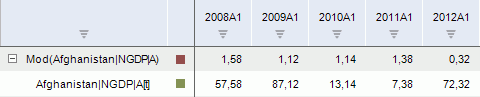
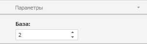

# Остаток от деления

Остаток от деления
-

# Остаток от деления

Метод «Остаток от деления»
 вычисляет остаток от деления значений ряда на заданное число. Входит в
 группу арифметических методов.

[Для применения
 метода](javascript:TextPopup(this))

		- Выделите один или несколько рядов в таблице данных;

		- Выполните команду «Остаток
		 от деления» в раскрывающемся меню кнопки «Арифметика»
		  на вкладке ленты «Вычисления».

После применения метода в рабочей книге на основе каждого выделенного
 ряда будет создан вычисляемый ряд с наименованием вида «Mod(<Имя_Ряда>)»,
 содержащий результаты расчета. Например:

## Настройка параметров расчёта. Вкладка «Параметры»

Для настройки параметров расчёта используйте вкладку «Параметры»
 на боковой панели.

[Для отображения
 вкладки](javascript:TextPopup(this))

		- Убедитесь, что боковая панель отображается;

		- Выделите в таблице данных ряд, рассчитанный методом «Остаток от деления»;

		- Установите переключатель «Ряд»
		 на боковой панели;

		- Перейдите на вкладку «Параметры».

В поле «База» задайте положительное
 число-делитель. По умолчанию делитель равняется двум.

Примечание.
 При выполнении операции Mod для
 операндов целого типа результат также будет целого типа.

См. также:

[Работа
 с вычисляемыми рядами](../../UiDw_ComputedSeries.htm) | [IModelling.Mod_](KeMs.chm::/Interface/IModelling/IModelling.Mod_.htm)

		Справочная
		 система на версию 10.9
		 от 18/08/2025,
		 © ООО «ФОРСАЙТ»,
