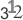
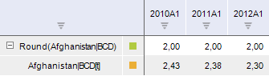
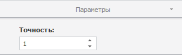

# Округление

Округление
-

# Округление

Метод «Округление» вычисляет
 значения ряда, округленные до целых чисел. Входит в группу арифметических
 методов.

[Для применения
 метода](javascript:TextPopup(this))

		- Выделите один или несколько рядов в таблице данных;

		- Выполните команду «Округление»
		 в раскрывающемся меню кнопки «Арифметика»
		  на вкладке ленты «Вычисления».

После применения метода в рабочей книге на основе каждого выделенного
 ряда будет создан вычисляемый ряд с наименованием вида «Round(<Имя_Ряда>)»,
 содержащий результаты расчета. Например:

## Настройка параметров расчёта. Вкладка «Параметры»

Для настройки параметров расчёта используйте вкладку «Параметры»
 на боковой панели.

[Для отображения
 вкладки](javascript:TextPopup(this))

		- Убедитесь, что боковая панель отображается;

		- Выделите в таблице данных ряд, рассчитанный методом «Округление»;

		- Установите переключатель «Ряд»
		 на боковой панели;

		- Перейдите на вкладку «Параметры».

В поле «Точность» укажите количество
 десятичных разрядов, до которого будут округлены значения ряда.

См. также:

[Работа
 с вычисляемыми рядами](../../UiDw_ComputedSeries.htm) | [IModelling.Round](KeMs.chm::/Interface/IModelling/IModelling.Round.htm)
 | [IModelling.Rounddown](KeMs.chm::/Interface/IModelling/IModelling.Rounddown.htm)
 | [IModelling.Roundup](KeMs.chm::/Interface/IModelling/IModelling.Roundup.htm)

		Справочная
		 система на версию 10.9
		 от 18/08/2025,
		 © ООО «ФОРСАЙТ»,
