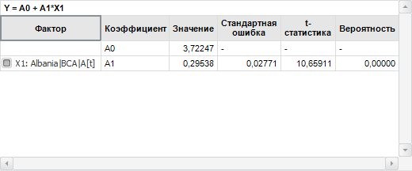
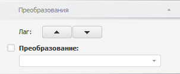
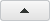
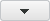
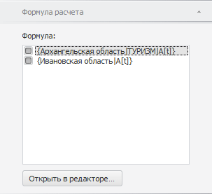
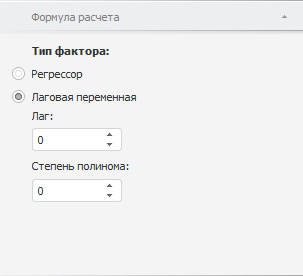

# Настройка факторов

Настройка факторов
-

# Настройка факторов

Факторы, используемые для расчета вычисляемого ряда, отображаются на
 вкладке «[Уравнение](../UiDw_Description.htm#equation)»
 на панели статистик. Например:

Настройка факторов доступна, если для расчета вычисляемого ряда используется
 метод «[Линейная
 регрессия (МНК)](Regression/UiDw_cs_LinearRegression.htm)» или «[Линейная
 регрессия (МИП)](Regression/UiDw_cs_TSLS.htm)». Для настройки факторов используйте группу вкладок
 «Уравнение» на боковой панели.

Примечание.
 Настройка факторов доступна только в настольном приложении.

[Исключение фактора
 из расчета](javascript:TextPopup(this))

	По умолчанию все факторы используются для расчета вычисляемого ряда.
	 Для исключения фактора из расчета:

		- Убедитесь, что [панель
		 статистик](../UiDw_Description.htm) отображается.

		- В рабочей книге выделите вычисляемый ряд.

		- Перейдите на вкладку «[Уравнение](../UiDw_Description.htm#equation)»
		 на панели статистик.

		- В таблице коэффициентов снимите флажок, соответствующий
		 фактору.

	Фактор будет исключен из расчета. Вычисляемый ряд будет пересчитан.

[Настройка преобразования
 фактора](javascript:TextPopup(this))

	Для настройки преобразования фактора используйте вкладку «Преобразования» на боковой панели.
	 Для отображения вкладки:

		- Убедитесь, что боковая панель и [панель
		 статистик](../UiDw_Description.htm) отображаются.

		- В рабочей книге выделите вычисляемый ряд.

		- Перейдите на вкладку «[Уравнение](../UiDw_Description.htm#equation)»
		 на панели статистик.

		- В таблице коэффициентов выделите фактор, для которого требуется
		 настроить преобразование.

		- На боковой панели установите переключатель «Уравнение»
		 и перейдите на вкладку «Преобразования».

	

	Для изменения лага фактора
	 используйте группу кнопок «Лаг»:

		- для увеличения лага нажмите кнопку .
		 Значения фактора будут сдвинуты вперед во временном интервале;

		- для уменьшения лага нажмите кнопку . Значения
		 фактора будут сдвинуты назад во временном интервале.

	Лаг фактора будет изменен. Величина лага будет отражена в наименовании
	 фактора в таблице коэффициентов.

	Для применения преобразования
	 к значениям фактора установите флажок «Преобразование»
	 и выберите требуемое преобразование из раскрывающегося списка. Подробное
	 описание доступных преобразований приведено в разделе «[Преобразование
	 значений ряда](../UiDw_Series_Inversion.htm)».

[Настройка обработки
 пропусков фактора](javascript:TextPopup(this))

	По умолчанию к фактору применяется метод обработки пропусков, используемый
	 для вычисляемого ряда. Для выбора иного метода обработки пропусков
	 используйте вкладку «Обработка пропусков»
	 на боковой панели. Для отображения вкладки:

		- Убедитесь, что боковая панель и [панель
		 статистик](../UiDw_Description.htm) отображаются.

		- В рабочей книге выделите вычисляемый ряд.

		- Перейдите на вкладку «[Уравнение](../UiDw_Description.htm#equation)»
		 на панели статистик.

		- В таблице коэффициентов выделите фактор, для которого требуется
		 настроить обработку пропусков.

		- На боковой панели установите переключатель «Уравнение»
		 и перейдите на вкладку «Обработка
		 пропусков».

	

	Для применения к фактору метода обработки пропусков:

		- используемого для вычисляемого
		 ряда. Установите переключатель «По
		 умолчанию (настройки уравнения)»;

		- отличного от метода обработки
		 пропусков вычисляемого ряда. Установите переключатель «Выбрать другой метод» и выберите
		 требуемый метод из раскрывающегося списка. Если требуется, задайте
		 параметры обработки пропусков выбранным методом. Подробное описание
		 методов обработки пропусков приведено в разделе «[Обработка
		 пропусков](UiDw_cs_MisingData_Method.htm)».

	К фактору будет применен выбранный метод обработки пропусков. Вычисляемый
	 ряд будет пересчитан.

[Редактирование
 формулы расчета фактора](javascript:TextPopup(this))

	Для редактирования формулы расчета фактора используйте вкладку «Формула расчета» на боковой панели.
	 Для отображения вкладки:

		- Убедитесь, что боковая панель и [панель
		 статистик](../UiDw_Description.htm) отображаются.

		- В рабочей книге выделите вычисляемый ряд.

		- Перейдите на вкладку «[Уравнение](../UiDw_Description.htm#equation)»
		 на панели статистик.

		- В таблице коэффициентов выделите фактор.

		- На боковой панели установите переключатель «Уравнение»
		 и перейдите на вкладку «Формула
		 расчета».

	На вкладке содержатся все доступные факторы:

	

	Выберите фактор, формулу которого требуется отредактировать и нажмите
	 кнопку «Открыть в редакторе».
	 Будет открыт [редактор выражения](UiNav.Chm::/GUI/ExpressionEditor.htm), в котором задайте формулу расчета фактора.

	После завершения редактирования формулы значения фактора будут пересчитаны.
	 Вычисляемый ряд будет пересчитан.

[Выбор типа фактора](javascript:TextPopup(this))

	Выбор типа фактора доступен, если для расчета вычисляемого ряда
	 используется метод «[Линейная регрессия
	 (МНК)](Regression/UiDw_cs_LinearRegression.htm)».

	Для выбора типа фактора используйте вкладку «Формула
	 расчета» на боковой панели. Для отображения вкладки:

		- Убедитесь, что боковая панель и [панель
		 статистик](../UiDw_Description.htm) отображаются.

		- В рабочей книге выделите вычисляемый ряд, рассчитанный методом
		 «[Линейная
		 регрессия (МНК)](Regression/UiDw_cs_LinearRegression.htm)».

		- Перейдите на вкладку «[Уравнение](../UiDw_Description.htm#equation)»
		 на панели статистик.

		- В таблице коэффициентов выделите фактор, тип которого требуется
		 изменить.

		- На боковой панели установите переключатель «Уравнение»
		 и перейдите на вкладку «Формула
		 расчета».

	

	Укажите тип фактора:

		- Регрессор. Фактор
		 будет использоваться в качестве независимой переменной. Для фактора
		 данного типа доступно [редактирование формулы](#formula);

		- Лаговая переменная.
		 Фактор будет использоваться в качестве лаговой переменной. Лаговая
		 переменная - это переменная, значения которой рассматриваются
		 в различные моменты времени, разделенные некоторым промежутком
		 (лагом). Задайте параметры лаговой переменой:

			- Лаг. Задайте
			 максимальную величину лага;

			- Степень полинома.
			 Задайте степень полинома, описывающего структуру лага.

	Таким образом, для расчета вычисляемого
	 ряда будут применяться [модель
	 распределенных лагов](Lib.chm::/02_Time_series_analysis/UiModelling_Polinimial_Distributed_Lags.htm).

	После выбора типа фактора вычисляемый ряд будет пересчитан.

См. также:

[Работа с вычисляемыми рядами](../UiDw_ComputedSeries.htm)

		Справочная
		 система на версию 10.9
		 от 18/08/2025,
		 © ООО «ФОРСАЙТ»,
