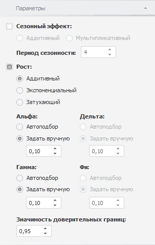

# Настройка параметров экспоненциального сглаживания

Настройка параметров экспоненциального сглаживания
-

# Настройка параметров экспоненциального сглаживания

Для настройки базовых параметров [экспоненциального
 сглаживания](UiDw_cs_ExponentialSmoothing.htm) используйте вкладку «Параметры»
 на боковой панели.

[Для отображения
 вкладки](javascript:TextPopup(this))

		- Убедитесь, что боковая панель отображается.

		- Выделите в таблице данных ряд, рассчитанный методом «Экспоненциальное сглаживание».

		- Установите переключатель «Ряд»
		 на боковой панели.

		- Перейдите на вкладку «Параметры».

Параметры метода:

	- Сезонный эффект. Если
	 флажок установлен, то при расчёте учитывается [сезонный
	 эффект](Lib.chm::/02_Time_series_analysis/UiModelling_ExpSmooth_season.htm). Это подразумевает выделение сезонной составляющей,
	 когда в исходном ряде наблюдаются достаточно постоянные периодические
	 отклонения в абсолютном выражении от варьирующего во времени среднего
	 уровня ряда с заранее известным периодом. Для отражения сезонной особенности
	 в модели используется коэффициент «Дельта».

Временной ряд разделяют на систематическую
 и сезонную составляющие. Укажите используемый эффект сезонности:

	-

		- Аддитивный. Используется
		 по умолчанию. Ряд рассматривается как сумма систематической и
		 сезонной составляющих;

		- Мультипликативный.
		 Ряд рассматривается как произведение систематической и сезонной
		 составляющих;

	- Период сезонности. Если
	 выбран какой-либо сезонный эффект, то задайте длину периода сезонности.
	 Значение по умолчанию - «4»;

Совет.
 Минимальное число наблюдений ряда должно удовлетворять неравенству: число
 наблюдений >= (Период сезонности * 2 + 1).

	- Рост. Временные ряды
	 часто имеют тенденцию некоторого роста (убывания). Если флажок установлен,
	 то в модель экспоненциального сглаживания использует коэффициент,
	 учитывающий рост - «Гамма».
	 Укажите [модель
	 роста](Lib.chm::/02_Time_series_analysis/UiModelling_ExpSmooth_growthhtm.htm):

	-

		- Аддитивный;

		- Экспоненциальный;

		- Затухающий;

	- Альфа. Дельта.
	 Гамма. Фи.
	 Задайте значения коэффициентов модели. Набор доступных коэффициентов
	 зависит от выбранных параметров роста и сезонного эффекта.

	Если установлен переключатель «Автоподбор»,
	 то коэффициент оценивается автоматически. Оцененное значение отображается
	 в соответствующем редакторе чисел. Для задания параметров автоматической
	 оценки коэффициентов используйте вкладку «[Автоподбор параметров](Panel_paramAutofit.htm)» на
	 боковой панели.

	Если установлен переключатель «Задать
	 вручную», то значение коэффициента задается пользователем в
	 соответствующем редакторе чисел. Диапазон допустимых значений коэффициентов:

		- Альфа.
		 (0, 1];

		- Дельта.
		 [0, 1];

		- Гамма.
		 [0, 1];

		- Фи.
		 (0, 1);

Совет.
 Для просмотра идентифицированного уравнения и таблицы со значениями оцененных
 коэффициентов используйте вкладку «[Уравнение](../../UiDw_Description.htm#equation)» на
 [панели статистик](../../UiDw_Description.htm).

	- Значимость доверительных границ.
	 Задайте уровень значимости доверительных границ прогнозного ряда.
	 Диапазон допустимых значений: (0, 1). Значение по умолчанию - «0,95».

См. также:

[Экспоненциальное сглаживание](UiDw_cs_ExponentialSmoothing.htm)
 | [Работа
 с вычисляемыми рядами](../../UiDw_ComputedSeries.htm)

		Справочная
		 система на версию 10.9
		 от 18/08/2025,
		 © ООО «ФОРСАЙТ»,
