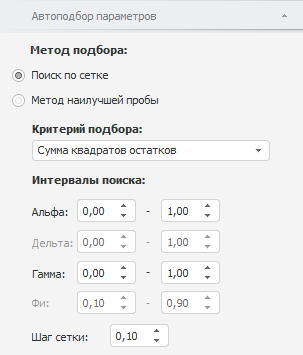
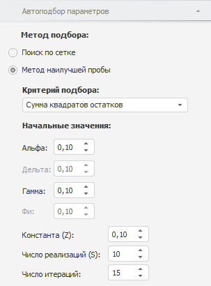

# Настройка автоподбора значений параметров

Настройка автоподбора значений параметров
-

# Настройка автоподбора значений параметров

Для настройки параметров автоматического подбора значений коэффициентов
 в модели [экспоненциального
 сглаживания](UiDw_cs_ExponentialSmoothing.htm) используйте вкладку «Автоподбор
 параметров» на боковой панели.

[Для отображения
 вкладки](javascript:TextPopup(this))

		- Убедитесь, что боковая панель отображается;

		- Выделите в таблице данных ряд, рассчитанный методом «Экспоненциальное сглаживание»;

		- Установите переключатель «Ряд»
		 на боковой панели;

		- Перейдите на вкладку «[Параметры](Panel_Param_ExpSmooth.htm)»;

		- Установите переключатель «Подобрать»
		 для одного из коэффициентов: «Альфа»,
		 «Дельта», «Гамма»
		 или «Фи»;

		- Перейдите на вкладку «Автоподбор
		 параметров».

Вкладка всегда содержит группы:

	- Метод подбора. Задайте
	 метод подбора значений коэффициентов;

	- Критерий подбора. Укажите
	 критерий, по которому подбираются значения коэффициентов.

Остальной набор параметров зависит от выбранного метода подбора значений
 коэффициентов.

## Поиск по сетке

Вид вкладки, если метод подбора - «Поиск
 по сетке»:

Группа «Интервалы поиска» определяет,
 в каких пределах искать значения коэффициентов «Альфа»,
 «Дельта», «Гамма»,
 «Фи». В соответствующих редакторах
 чисел задайте интервал поиска, учитывая ограничения:

	- для нижней границы (первый редактор чисел) минимальное значение
	 - нуль, максимальное - единица;

	- для верхней границы (второй редактор чисел) минимальное значение
	 - значение нижней границы, максимальное - единица.

Доступность интервалов поиска значений коэффициентов зависит от сезонного
 эффекта и модели роста.

Если значение коэффициента было установлено вручную, то редактирование
 интервала недоступно.

Параметр «Шаг сетки» определяет
 величину интервала, с которым выполняется поиск по сетке.

## Метод наилучшей пробы

Вид вкладки, если метод подбора - «Метод
 наилучшей пробы»:

Группа «Начальные значения»
 определяет:

	- Альфа. Дельта.
	 Гамма. Фи.
	 В соответствующих редакторах чисел задайте начальные значения для
	 поиска значений коэффициентов. Доступность редакторов зависит от сезонного
	 эффекта и модели роста. Если значение коэффициента было задано вручную,
	 то редактирование также недоступно;

	- Константа (Z). Вещественное
	 значение константы, используемое для метода наилучшей пробы;

	- Число реализаций (S).
	 Число реализаций коэффициента;

	- Число итераций. Максимальное
	 число итераций, за которое должно быть получено значение.

См. также:

[Экспоненциальное сглаживание](UiDw_cs_ExponentialSmoothing.htm)
 | [Работа
 с вычисляемыми рядами](../../UiDw_ComputedSeries.htm)

		Справочная
		 система на версию 10.9
		 от 18/08/2025,
		 © ООО «ФОРСАЙТ»,
