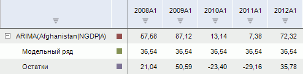
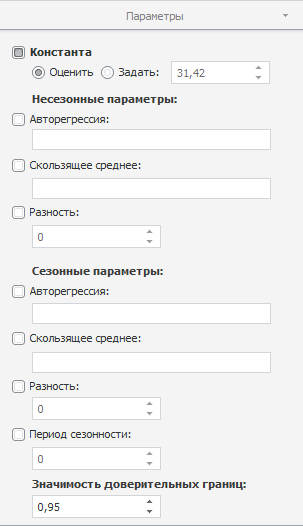

# ARIMA

ARIMA
-

# ARIMA

Моделирует значения ряда методом «ARIMA».
 Входит в группу «Прогноз».

«ARIMA» - одна из наиболее
 популярных моделей для построения краткосрочных прогнозов.

[Для применения
 метода](javascript:TextPopup(this))

		- Выделите несколько рядов в таблице данных;

		- Выполните команду «ARIMA»
		 в раскрывающемся меню кнопки  «Прогнозирование» на вкладке
		 ленты «Вычисления».

После применения метода в рабочей книге на основе каждого выделенного
 ряда будет создан вычисляемый ряд с наименованием вида «ARIMA(<Имя_Ряда>)»,
 содержащий результаты расчета. Например:

## Настройка параметров расчёта. Вкладка «Параметры»

Для настройки параметров расчёта используйте вкладку «Параметры»
 на боковой панели.

[Для отображения
 вкладки](javascript:TextPopup(this))

		- Убедитесь, что боковая панель отображается;

		- Выделите в таблице данных ряд, рассчитанный методом «ARIMA»;

		- Установите переключатель «Ряд»
		 на боковой панели;

		- Перейдите на вкладку «Параметры».

Параметры метода:

	- Константа. Если флажок
	 установлен, то в модели используется константа. Укажите метод расчёта
	 константы:

	-

		- Оценить. Значение
		 константы оценивается автоматически при расчете метода. Полученное
		 значение будет отображено в поле ввода справа;

		- Задать. Значение
		 константы задается пользователем в соответствующем поле;

	- Несезонные/сезонные параметры.
	 Задайте несезонные/сезонные параметры метода:

	-

		- Авторегрессия. По
		 умолчанию флажок снят. Если флажок установлен, то учитывается
		 указанный порядок несезонной/сезонной авторегрессии;

		- Скользящее среднее.
		 Если флажок установлен, то учитывается указанный порядок несезонного/сезонной
		 скользящего среднего;

Совет.
 Вводите номера или диапазоны порядка скользящего среднего и авторегрессии,
 разделенные запятыми. Диапазон порядка указывайте через знак «-». Например:
 1-3,5,7-9. В настольном приложении для настройки параметров авторегрессии/скользящего
 среднего используйте вкладку «[Параметры
 оценки ARMA](../Panel_ARMA.htm)» на боковой панели.

	-

		- Разность. Если флажок
		 установлен, то учитывается указанный порядок дифференцирования
		 несезонной/сезонной составляющей ряда.

	- Период
	 сезонности. Продолжительность периода сезонности (например,
	 четыре квартала или двенадцать месяцев);

	- Значимость
	 доверительных границ. Задайте уровень значимости доверительных
	 границ прогнозного ряда. Диапазон допустимых значений: (0, 1). Значение
	 по умолчанию - «0,95».

См. также:

[Работа
 с вычисляемыми рядами](../../UiDw_ComputedSeries.htm) | Метод «[ARIMA](Lib.chm::/02_Time_series_analysis/UiModelling_ARIMA.htm)»
 | Контейнер моделирования: модель «[ARIMA](UiModelling.chm::/2_Container_of_Modeling/2_3_Work_object/2_3_2_Model/Specification/1_Arima/uimodelling_model_specification_arima.htm)»

		Справочная
		 система на версию 10.9
		 от 18/08/2025,
		 © ООО «ФОРСАЙТ»,
