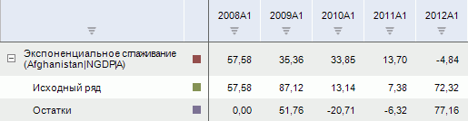
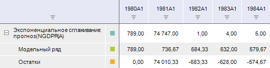

# Экспоненциальное сглаживание

Экспоненциальное сглаживание
-

# Экспоненциальное сглаживание

Применяет к значениям ряда метод «Экспоненциальное
 сглаживание». Входит в группы «Сглаживание»
 и «Прогнозирование».

Метод «Экспоненциального сглаживания»
 является способом усреднения значений временного ряда. В отличие от метода
 скользящего среднего в определении экспоненциальной средней участвуют
 все наблюдения исходного временного ряда, но с разными весовыми коэффициентами.
 Для экспоненциального сглаживания момент времени, в который наблюдалось
 значение временного ряда, играет решающую роль. Здесь более старым наблюдениям
 приписываются экспоненциально убывающие веса, при этом учитываются все
 предшествующие наблюдения ряда.

[Для применения
 метода](javascript:TextPopup(this))

		- Выделите несколько рядов в таблице данных.

		- В зависимости от метода расчета выполните команду «Экспоненциальное сглаживание»
		 в раскрывающемся меню кнопки 
		 «Сглаживание» или  «Прогнозирование»
		 на вкладке «Вычисления»
		 ленты инструментов.

После применения метода в рабочей книге на основе каждого выделенного
 ряда будет создан вычисляемый ряд, содержащий результаты расчета, с наименованием
 вида:

	- при выполнении метода из категории «[Сглаживание](../UiDw_cs_common.htm#smoothing)» - «Экспоненциальное сглаживание(<Имя_Ряда>)».
	 Например:

	- при выполнении метода из категории «[Прогнозирование](../UiDw_cs_common.htm#forecast)»
	 - «Экспоненциальное сглаживание:
	 прогноз(<Имя_Ряда>)». Например:

## Настройка параметров расчёта

Для настройки специфических параметров расчёта используйте вкладки на
 боковой панели:

	- [Параметры](Panel_Param_ExpSmooth.htm).
	 Позволяет изменить базовые параметры расчёта: модели сезонности и
	 роста;

	- [Автоподбор
	 параметров](Panel_paramAutofit.htm). Позволяет настроить параметры автоматического
	 подбора значений коэффициентов, используемых при расчёте метода.

См. также:

[Работа
 с вычисляемыми рядами](../../UiDw_ComputedSeries.htm) | [Метод
 экспоненциального сглаживания](Lib.chm::/02_Time_series_analysis/UiModelling_ExpSmooth.htm) | Контейнер моделирования:
 модель «[Экспоненциальное
 сглаживание](UiModelling.chm::/2_Container_of_Modeling/2_3_Work_object/2_3_2_Model/Specification/5_Exponential_smoothing/uimodelling_model_specification_exponential.htm)» | [IModelling.Expsmooth](KeMs.chm::/Interface/IModelling/IModelling.Expsmooth.htm) |
 [IMsExponentialSmoothingTransform](KeMs.chm::/Interface/IMsExponentialSmoothingTransform/IMsExponentialSmoothingTransform.htm)

		Справочная
		 система на версию 10.9
		 от 18/08/2025,
		 © ООО «ФОРСАЙТ»,
