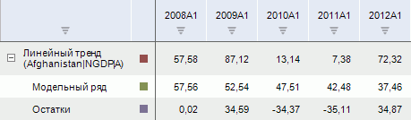
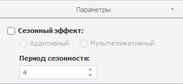

# Тренд

Тренд
-

# Тренд

Метод позволяет исключить из временного ряда сезонную составляющую и
 построить теоретический временной ряд, в основе которого лежит математически-выраженная
 закономерность изменения. В базе данных временных рядов доступны следующие
 модели тренда:

	- Авто-тренд;

Примечание.
 При изменении данных исходного ряда вычисляемый ряд «Авто-тренд»
 автоматически подбирает оптимальный тренд и повторно рассчитывается.

	- Геометрический тренд;

	- Линейный тренд;

	- Логарифмический параболический
	 тренд;

	- Обратный тренд;

	- Параболический тренд;

	- Экспоненциальный тренд.

Методы тренда входят в группу «Прогнозирование».

[Для применения
 метода](javascript:TextPopup(this))

		- Выделите несколько рядов в таблице данных.

		- Выполните соответствующую команду в раскрывающемся меню
		 кнопки  «Прогнозирование»,
		 расположенной в группе «Вычисления»
		 на вкладке «Вычисления»
		 ленты инструментов.

	Совет. Для быстрого
	 запуска метода «Авто-тренд»
	 нажмите на верхнюю часть кнопки  «Прогнозирование».

После применения метода в рабочей книге на основе каждого выделенного
 ряда будет создан вычисляемый ряд с наименованием вида «<Наименование_метода>(<Имя_Ряда>)»,
 содержащий результаты расчета. Например:

## Настройка параметров расчёта. Вкладка «Параметры»

Для настройки параметров расчёта используйте вкладку «Параметры»
 на боковой панели.

[Для отображения
 вкладки](javascript:TextPopup(this))

		- Убедитесь, что боковая панель отображается.

		- Выделите в таблице данных ряд, рассчитанный с помощью тренда.

		- Установите переключатель «Ряд»
		 на боковой панели.

		- Перейдите на вкладку «Параметры».

Задайте на вкладке параметры метода:

	- Сезонный эффект. Для
	 учёта при расчёте сезонного эффекта установите флажок «Сезонный
	 эффект». Укажите метод, применяемый для выделения сезонной
	 составляющей исходного ряда:

		- Аддитивный. Используется
		 по умолчанию. Ряд рассматривается как сумма систематической и
		 нерегулярной составляющих;

		- Мультипликативный.
		 Ряд рассматривается как произведение систематической и нерегулярной
		 составляющих.

Если сезонность отсутствует, то на основе
 исходного ряда осуществляется оценка коэффициентов уравнения методом наименьших
 квадратов.

Если ряд содержит сезонную составляющую,
 то вначале выполняются вычисления, связанные с исключением этой периодически
 повторяющейся компоненты из исходного ряда. После того как сезонная составляющая
 вычислена и исключена из исходного ряда, осуществляется оценка коэффициентов
 уравнения. Для оценки используется линейный метод наименьших квадратов.

	- Период сезонности. С
	 помощью редактора чисел или клавиатуры определите длину периода сезонности.
	 Параметр используется, если задан какой-либо сезонный эффект.

См. также:

[Работа
 с вычисляемыми рядами](../../UiDw_ComputedSeries.htm) | [Тренд
 с подбором функциональной зависимости](Lib.chm::/02_Time_series_analysis/UiModelling_TrendCurveEstimation.htm) | Контейнер моделирования:
 модель «[Тренд
 с подбором функциональной зависимости](UiModelling.chm::/2_Container_of_Modeling/2_3_Work_object/2_3_2_Model/Specification/9_Universal_graph/9_universal_graph.htm)» | [IModelling.Extrapolate](KeMs.chm::/Interface/IModelling/IModelling.Extrapolate.htm)

		Справочная
		 система на версию 10.9
		 от 18/08/2025,
		 © ООО «ФОРСАЙТ»,
