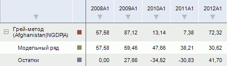

# Грей-метод

Грей-метод
-

# Грей-метод

Моделирует значение ряда Грей-методом. Входит в группу «Прогнозирование».

В отличие от традиционных статистических методов анализа временных рядов,
 которые накладывают достаточно жесткое ограничение к линейности ряда,
 Грей-метод подходит для прогнозирования поведения нелинейных временных
 рядов. Данный метод относится к нестатистическим методам прогнозирования
 и особенно эффективен в условиях недостаточного числа наблюдений.

[Для применения
 метода](javascript:TextPopup(this))

		- Выделите несколько рядов в таблице данных;

		- Выполните команду «Грей-метод»
		 в раскрывающемся меню кнопки  «Прогнозирование» на вкладке
		 ленты «Вычисления».

После применения метода в рабочей книге на основе каждого выделенного
 ряда будет создан вычисляемый ряд с наименованием вида «Грей-метод(<Имя_Ряда>)»,
 содержащий результаты расчета. Например:

См. также:

[Работа
 с вычисляемыми рядами](../../UiDw_ComputedSeries.htm) | Контейнер моделирования: [Спецификация
 Грей-метода](UiModelling.chm::/2_Container_of_Modeling/2_3_Work_object/2_3_2_Model/Specification/UiModelling_Specification_GrayForecast.htm) | [Модель GM(1,1)(Грей-метод)](Lib.chm::/02_Time_series_analysis/Grey.htm) |
 [IModelling.Greyforecast](KeMs.chm::/Interface/IModelling/IModelling.Greyforecast.htm)

		Справочная
		 система на версию 10.9
		 от 18/08/2025,
		 © ООО «ФОРСАЙТ»,
