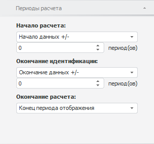

# Настройка периодов расчёта

Настройка периодов расчёта
-

# Настройка периодов расчёта

Для редактирования периода расчёта вычисляемого ряда используйте вкладку
 «Периоды расчёта» на боковой
 панели.

[Для отображения
 вкладки](javascript:TextPopup(this))

		- Убедитесь, что боковая
		 панель отображается.

		- Выделите в таблице данных вычисляемый ряд.

		- Установите переключатель «Ряд»
		 на боковой панели.

		- Перейдите на вкладку «Периоды
		 расчёта».

	Совет. Для быстрого
	 отображения группы вкладок «Ряд»
	 на боковой панели выполните команду «Показать
	 параметры» в контекстном меню выбранного ряда.

Задайте на вкладке следующие параметры:

[Начало расчета](javascript:TextPopup(this))

	Определите начальную точку периода идентификации. Укажите способ
	 расчета даты начала периода:

		- Начало данных +/-.
		 Дата равна первой фактической дате входного ряда плюс число периодов,
		 указанных в соответствующем редакторе чисел;

		- Определённая дата.
		 Дата указывается в соответствующем редакторе дат;

		- Сегодня +/-. Дата
		 равна текущей дате плюс число периодов, указанных в соответствующем
		 редакторе чисел;

		- От конца периода идентификации.
		 Дата начала периода идентификации равна дате окончания периода
		 идентификации минус число периодов, указанных в соответствующем
		 редакторе чисел;

		- От окончания расчёта.
		 Дата начала периода идентификации равна дате окончания периода
		 расчёта минус число периодов, указанных в соответствующем редакторе
		 чисел;

	Примечание.
	 Способ «От конца периода идентификации»
	 доступен, если вычисляемый ряд рассчитан [регрессионным](../UiDw_cs_common.htm#regression)
	 или [прогнозным](../UiDw_cs_common.htm#forecast) методом.
	 В остальных случаях доступен способ «От
	 окончания расчёта».

[Окончание идентификации](javascript:TextPopup(this))

	Определите конечную точку периода идентификации.

	Примечание.
	 Настройка конечной точки периода идентификации доступна, если вычисляемый
	 ряд рассчитан [регрессионным](../UiDw_cs_common.htm#regression)
	 или [прогнозным](../UiDw_cs_common.htm#forecast) методом.

	Укажите способ расчета даты окончания периода:

		- Начало данных +/-.
		 Дата равна первой фактической дате входного ряда плюс число периодов,
		 указанных в соответствующем редакторе чисел;

		- Окончание данных +/-.
		 Дата равна последней фактической дате входного ряда плюс число
		 периодов, указанных в соответствующем редакторе чисел;

		- Определённая дата.
		 Дата указывается в соответствующем редакторе дат;

		- Сегодня +/-. Дата
		 равна текущей дате плюс число периодов, указанных в соответствующем
		 редакторе чисел;

		- От начала расчёта.
		 Дата окончания периода идентификации равна дате начала периода
		 идентификации плюс число периодов, указанных в соответствующем
		 редакторе чисел.

[Окончание расчета](javascript:TextPopup(this))

	Определите конечную точку расчёта. Укажите способ расчета даты:

		- Конец периода отображения.
		 Дата равна дате окончания периода отображения данных в рабочей
		 книге;

		- Определённая дата.
		 Дата указывается в соответствующем редакторе дат;

		- Окончание данных +/-.
		 Дата равна последней фактической дате входного ряда плюс число
		 периодов, указанных в соответствующем редакторе чисел;

		- Сегодня +/-. Дата
		 равна текущей дате плюс число периодов, указанных в соответствующем
		 редакторе чисел;

		- От конца периода идентификации.
		 Дата окончания расчёта равна дате окончания периода идентификации
		 плюс число периодов, указанных в соответствующем редакторе чисел;

		- От начала расчёта.
		 Дата окончания расчёта равна дате начала расчёта плюс число периодов,
		 указанных в соответствующем редакторе чисел.

	Примечание.
	 Способ «От конца периода идентификации»
	 доступен, если вычисляемый ряд рассчитан [регрессионным](../UiDw_cs_common.htm#regression)
	 или [прогнозным](../UiDw_cs_common.htm#forecast) методом.
	 В остальных случаях доступен способ «От
	 начала расчёта».

После изменения границ периода расчёта вычисляемый ряд должен быть рассчитан
 заново.

Примечание.
 Если используется способ «Сегодня +/-»,
 то даты окончания идентификации и прогнозирования смещаются на конец периода.
 Актуально для динамик от месячной и выше.

Например, дата окончания идентификации - апрель 2012, а дата окончания
 расчёта равняется дате окончания идентификации. Таким образом, при вычислении
 ряда дата окончания расчёта - 30.04.2012.

См. также:

[Настройка
 параметров метода расчёта](../UiDw_cs_common.htm)

		Справочная
		 система на версию 10.9
		 от 18/08/2025,
		 © ООО «ФОРСАЙТ»,
