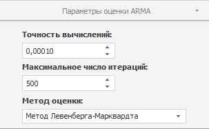

# Настройка параметров авторегрессии и скользящего среднего

Настройка параметров авторегрессии и скользящего среднего
-

# Настройка параметров авторегрессии и скользящего среднего

Для настройки параметров оценки коэффициентов авторегрессии/скользящего
 среднего (ARMA) используйте вкладку «Параметры
 оценки ARMA», расположенную на боковой панели. Вкладка отображается,
 если для метода задан порядок ARMA.

Примечание.
 Настройка параметров оценки ARMA доступна только в настольном приложении.

[Для отображения
 вкладки](javascript:TextPopup(this))

		- Убедитесь, что боковая панель отображается;

		- Выделите в таблице данных вычисляемый ряд;

		- Установите переключатель «Ряд»
		 на боковой панели;

		- Перейдите на вкладку «Параметры»;

		- Задайте порядок авторегрессии или скользящего среднего;

		- Перейдите на вкладку «Параметры
		 оценки ARMA».

Параметры оценки ARMA:

	- Точность вычислений.
	 Укажите точность вычислений модели. Минимальное значение: 0.00001;
	 значение по умолчанию: 0.0001;

	- Максимальное число итераций.
	 Задайте максимальное число итераций, за которое должны быть получены
	 оценки коэффициентов ARMA. При большом числе итераций достигается
	 наибольшая точность вычислений, но затрачивается больше времени.

	Минимальное значение: 1; значение по умолчанию: 500;

	- Метод оценки. Из раскрывающегося
	 списка выберите метод оценки коэффициентов ARMA.

См. также:

[Настройка
 параметров метода расчёта](UiDw_cs_common.htm)

		Справочная
		 система на версию 10.9
		 от 18/08/2025,
		 © ООО «ФОРСАЙТ»,
