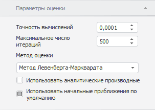
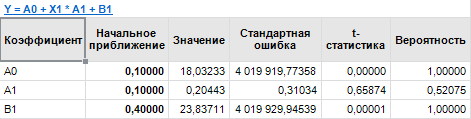

# Настройка дополнительных параметров расчета нелинейной регрессии

Настройка дополнительных параметров расчета нелинейной регрессии
-

# Настройка дополнительных параметров расчета

Для нелинейной регрессии можно настроить:

	- [параметры расчета](#calc_params);

	- [параметры оценки коэффициентов](#estimation);

	- [значения начальных приближений](#inital_vals).

## Настройка параметров расчета

Для настройки параметров расчета используйте вкладку «Параметры»
 на боковой панели.

[Для отображения
 вкладки](javascript:TextPopup(this))

		- Убедитесь, что боковая панель отображается.

		- Выделите в таблице данных ряд, рассчитанный методом «Нелинейная регрессия».

		- Установите переключатель «Ряд»
		 на боковой панели.

		- Перейдите на вкладку «Параметры».

Параметры метода:

	- Выходной ряд. Укажите
	 ряд, в который будут выгружены результаты;

	- Значимость доверительных границ.
	 Задайте уровень значимости доверительных границ прогнозного ряда.
	 Диапазон допустимых значений: (0, 1). Значение по умолчанию - 0,95.

## Настройка оценки коэффициентов

Для настройки параметров оценки коэффициентов нелинейной регрессии используйте
 вкладку «Параметры оценки» на
 боковой панели.

[Для отображения
 вкладки](javascript:TextPopup(this))

		- Убедитесь, что боковая панель отображается.

		- Выделите в таблице данных ряд, рассчитанный методом «Нелинейная регрессия».

		- Установите переключатель «Ряд»
		 на боковой панели.

		- Перейдите на вкладку «Параметры
		 оценки».

Параметры оценки нелинейной регрессии:

	- Точность вычислений.
	 Укажите точность вычислений уравнения. Минимальное значение: 0.00001;
	 значение по умолчанию: 0.0001;

	- Максимальное число итераций.
	 Задайте максимальное число итераций, за которое должны быть получены
	 оценки коэффициентов нелинейной регрессии. При большом числе итераций
	 достигается наибольшая точность вычислений, но затрачивается больше
	 времени.

	Минимальное значение: 1; значение по умолчанию: 500;

	- [Метод оценки](Lib.chm::/02_Time_series_analysis/Lib_ARIMA_Coef.htm).
	 Из раскрывающегося списка выберите метод оценки коэффициентов нелинейной
	 регрессии;

	- Использовать аналитические
	 производные. Установка данного флажка повышает точность расчетов,
	 путем расчета аналитических производных для уравнения нелинейной регрессии;

	- Использовать начальные приближения
	 по умолчанию. По умолчанию флажок установлен и для расчета
	 используются начальные приближения коэффициентов уравнения, заданные
	 по умолчанию. Если флажок снят, то используются начальные приближения,
	 заданные пользователем. Для просмотра и редактирования начальных приближений
	 используйте вкладку «Уравнение»
	 на [панели статистик](../../UiDw_Description.htm).

## Задание значений начальных приближений

Для задания значений начальных приближений коэффициентов уравнения нелинейной
 регрессии используйте вкладку «Уравнение»
 на [панели статистик](../../UiDw_Description.htm). При расчете
 нелинейной регрессии на вкладке дополнительно отображаются значения начальных
 приближений коэффициентов.

[Для отображения
 вкладки](javascript:TextPopup(this))

		- Убедитесь, что [панель
		 статистик](../../UiDw_Description.htm) отображается.

		- Выделите в таблице данных ряд, рассчитанный методом «Нелинейная регрессия».

		- Перейдите на вкладку «Уравнение».

Для редактирования значений начальных приближений коэффициентов введите
 требуемые значения начальных приближений в столбец «Начальное
 приближение».

Вычисляемый ряд будет пересчитан с новыми значениями начальных приближений
 коэффициентов.

Примечание.
 Для возврата начальных приближений, заданных по умолчанию, установите
 флажок «Использовать начальные приближения
 по умолчанию» на вкладке «[Параметры
 оценки](#estimation)» на боковой панели. Флажок автоматически снимается при
 редактировании значений начальных приближений.

См. также:

[Нелинейная регрессия](UiDw_cs_NonLinearRegression.htm)

		Справочная
		 система на версию 10.9
		 от 18/08/2025,
		 © ООО «ФОРСАЙТ»,
