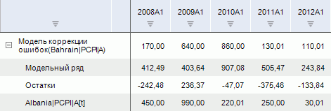
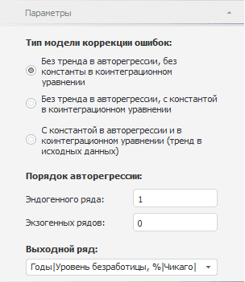

# Модель коррекции ошибок

Модель коррекции ошибок
-

# Модель коррекции ошибок

Метод выполняет [коррекцию
 ошибок](Lib.chm::/02_Time_series_analysis/UiModelling_ErrCorrModel.htm) в данных. Входит в группу «Регрессия».

[Для применения
 метода](javascript:TextPopup(this))

		- Выделите несколько рядов в таблице данных;

		- Выполните команду «Модель
		 коррекции ошибок» в раскрывающемся меню кнопки  «Регрессия» на вкладке ленты
		 «Вычисления».

После применения метода в рабочей книге на основе выделенных рядов
 будет создан вычисляемый ряд с наименованием вида «Модель
 коррекции ошибок(<Список_Экзогенных_Переменных>)», содержащий
 результаты расчета. Например:

## Настройка параметров расчёта. Вкладка «Параметры»

Для настройки параметров расчёта используйте вкладку «Параметры»
 на боковой панели.

[Для отображения
 вкладки](javascript:TextPopup(this))

		- Убедитесь, что боковая панель отображается;

		- Выделите в таблице данных ряд, рассчитанный методом «Модель коррекции ошибок»;

		- Установите переключатель «Ряд»
		 на боковой панели;

		- Перейдите на вкладку «Параметры».

Параметры метода:

	- Тип модели коррекции ошибок.
	 Выберите нужную модель:

		- без тренда в авторегрессии, без константы в коинтеграционном
		 уравнении;

		- без тренда в авторегрессии, с константой в коинтеграционном
		 уравнении;

		- с константой в авторегрессии и в коинтеграционном уравнении
		 (тренд в исходных данных);

	- Порядок авторегрессии эндогенного
	 и экзогенных рядов. Укажите порядок авторегрессии для эндогенного
	 и экзогенных рядов. Введите номера или диапазоны порядка авторегрессии,
	 разделенные запятыми. Диапазон порядка авторегрессии указывается через
	 знак «-»;

	- Выходной ряд. Укажите
	 результирующий ряд. Остальные ряды будут считаться экзогенными переменными.

См. также:

[Работа
 с вычисляемыми рядами](../../UiDw_ComputedSeries.htm) | Метод расчёта [модели
 коррекции ошибок](Lib.chm::/02_Time_series_analysis/UiModelling_ErrCorrModel.htm) | Контейнер моделирования: «[Модель
 коррекции ошибок](UiModelling.chm::/2_Container_of_Modeling/2_3_Work_object/2_3_2_Model/Specification/UiModelling_Specification_Error_control.htm)» | [IModelling.Ecm](KeMs.chm::/Interface/IModelling/IModelling.Ecm.htm)

		Справочная
		 система на версию 10.9
		 от 18/08/2025,
		 © ООО «ФОРСАЙТ»,
