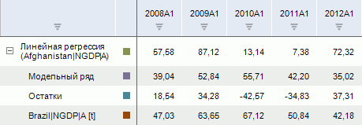

# Линейная регрессия (МНК)

Линейная регрессия (МНК)
-

# Линейная регрессия (МНК)

Выполняется расчёт метода «Линейная
 регрессия (МНК)». Входит в группу «Регрессия».

[Для применения
 метода](javascript:TextPopup(this))

		- Выделите несколько рядов в таблице данных;

		- Выполните команду «Линейная
		 регрессия (МНК)» в раскрывающемся меню кнопки  «Регрессия» на вкладке ленты
		 «Вычисления».

После применения метода в рабочей книге на основе выделенных рядов
 будет создан вычисляемый ряд с наименованием вида «Линейная
 регрессия(<Список_Объясняющих_Переменных>)», содержащий результаты
 расчета. Например:

## Настройка параметров расчёта

Для настройки факторов, используемых в методе, используйте группу вкладок
 «Уравнение» на боковой панели.
 Более подробно см. раздел «[Настройка факторов](../Factors.htm)».

Для настройки параметров расчёта используйте вкладку «Параметры»
 на боковой панели.

[Для отображения
 вкладки](javascript:TextPopup(this))

		- Убедитесь, что боковая панель отображается;

		- Выделите в таблице данных ряд, рассчитанный методом «Линейная регрессия (МНК)»;

		- Установите переключатель «Ряд»
		 на боковой панели;

		- Перейдите на вкладку «Параметры».

Параметры метода:

	- Выходной ряд. Укажите
	 ряд, в который будут выгружены результаты;

	- Константа. Если флажок
	 установлен, то в модели используется константа. Укажите метод расчёта
	 константы:

	-

		- Оценить. Значение
		 константы оценивается автоматически при расчете метода. Полученное
		 значение будет отображено в поле ввода справа;

		- Задать. Значение
		 константы задается пользователем в соответствующем поле;

	- Авторегрессия. По умолчанию
	 флажок снят. Если флажок установлен, то в модели используются коэффициенты
	 авторегрессии;

	- Скользящее среднее.
	 По умолчанию флажок снят. Если флажок установлен, то в модели используются
	 коэффициенты скользящего среднего;

Совет.
 Вводите номера или диапазоны порядка скользящего среднего и авторегрессии,
 разделенные запятыми. Диапазон порядка указывайте через знак «-». Например:
 1-3,5,7-9. В настольном приложении для настройки параметров авторегрессии/скользящего
 среднего используйте вкладку «[Параметры
 оценки ARMA](../Panel_ARMA.htm)» на боковой панели.

	- Значимость доверительных границ.
	 Задайте уровень значимости доверительных границ прогнозного ряда.
	 Диапазон допустимых значений: (0, 1). Значение по умолчанию - «0,95».

См. также:

[Работа
 с вычисляемыми рядами](../../UiDw_ComputedSeries.htm) | [Настройка факторов](../Factors.htm)
 | [Метод
 наименьших квадратов](Lib.chm::/01_Regression_models/UiModelling_LinearRegr_LSM.htm) | Контейнер моделирования: модель
 «[Линейная
 регрессии (оценка МНК)](UiModelling.chm::/2_Container_of_Modeling/2_3_Work_object/2_3_2_Model/Specification/8_Linear_regression/uimodelling_model_specification_linaer_reg.htm)» | [IModelling.Ols](KeMs.chm::/Interface/IModelling/IModelling.Ols.htm)

		Справочная
		 система на версию 10.9
		 от 18/08/2025,
		 © ООО «ФОРСАЙТ»,
