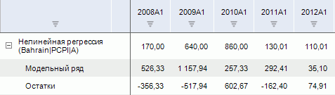
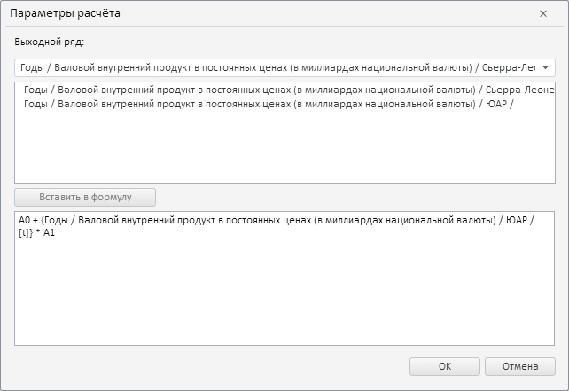

# Нелинейная регрессия

Нелинейная регрессия
-

# Нелинейная регрессия

Метод выполняет [нелинейные
 преобразования](Lib.chm::/01_Regression_models/UiModelling_NonLinearRegr.htm) данных. Входит в группу «Регрессия».

[Для применения
 метода](javascript:TextPopup(this))

		- Выделите несколько рядов в таблице данных.

		- Выполните команду «Нелинейная
		 регрессия» в раскрывающемся меню кнопки  «Регрессия», расположенной на
		 вкладке «Вычисления» ленты
		 инструментов.

В настольном приложении после применения метода будет открыт [редактор
 выражения](UiNav.Chm::/GUI/ExpressionEditor.htm). Задайте в нём формулу расчета нелинейной
 регрессии.

Примечание.
 В формуле обязательно должен присутствовать хотя бы один коэффициент и
 один объясняющий ряд, иначе нелинейное преобразование данных не может
 быть произведено.

Например: (Benin|A + Sudan|A) / 2 * f1,
 где «Benin|A», «Sudan|A»
 - объясняющие ряды, «f1» - коэффициент.

Если формула задана верно, то при нажатии кнопки «OK»
 окно редактора выражения будет закрыто, в рабочую книгу будет добавлен
 вычисляемый ряд с наименованием вида «Нелинейная
 регрессия(<Наименование_выходного_ряда>)», содержащий результаты
 расчета. Например:

[Особенности
 задания формулы расчета нелинейной регрессии в веб-приложении](javascript:TextPopup(this))

	В веб-приложении для задания формулы расчета будет отображен диалог
	 «Параметры расчета»:

	

	Диалог «Параметры расчета»
	 содержит:

		- выходной ряд. Укажите
		 результирующий ряд;

		- область рядов. Отображается
		 список рядов, доступных для составления формулы расчета;

		- область формулы.
		 Задайте формулу расчёта нелинейной регрессии. В формуле допускается
		 использование любых арифметических операций, цифр, знаков сравнения
		 и круглых скобок. Также доступно использование вложенных преобразований.

	Операции, предназначенные для создания формулы:

		- вставка ряда в формулу.
		 Дважды щелкните по требуемому ряду в дереве рядов или выделите
		 ряд в дереве рядов и нажмите кнопку «Вставить
		 в формулу». Ряд будет вставлен в место расположения
		 курсора;

		- вставка вложенного преобразования
		 в формулу. Введите наименование преобразования в области
		 формул. Параметры преобразования задаются в круглых скобках
		 через запятую после названия преобразования.

	Доступные вложенные преобразования совпадают
	 с набором функций, доступных в [редакторе
	 выражения](UiNav.Chm::/GUI/ExpressionEditor.htm) и приведены в разделе «[Функции, доступные
	 в редакторе выражения](UiNav.Chm::/GUI/Expression_editor_func.htm)».

## Редактирование формулы нелинейной регрессии

Для редактирования формулы нелинейной регрессии щёлкните по формуле, расположенной на вкладке «[Уравнение](../../UiDw_Description.htm#equation)» на
 панели статистики. Будет открыт [редактор
 выражения](UiNav.Chm::/GUI/ExpressionEditor.htm). Внесите необходимые изменения.

## Настройка параметров расчёта

Для настройки специфических параметров расчёта используйте:

	- вкладки на боковой панели:

		- [Параметры](NonLinearRegression_adjust.htm#calc_params).
		 Позволяет изменить базовые параметры расчёта: выходной ряд и значимость
		 доверительных границ;

		- [Параметры
		 оценки](NonLinearRegression_adjust.htm#estimation). Позволяет настроить параметры автоматического
		 подбора значений коэффициентов, используемых при расчёте метода;

	- вкладку «[Уравнение](NonLinearRegression_adjust.htm#inital_vals)»
	 на панели статистик. Позволяет задать значения начальных приближений.

См. также:

[Работа
 с вычисляемыми рядами](../../UiDw_ComputedSeries.htm) | Метод расчёта [нелинейной
 регрессии](Lib.chm::/01_Regression_models/UiModelling_NonLinearRegr.htm) | Контейнер моделирования: модель «[Нелинейная
 регрессия (оценка нелинейным МНК)](UiModelling.chm::/2_Container_of_Modeling/2_3_Work_object/2_3_2_Model/Specification/7_Nonlinear_regression/7_nonlinear_regression.htm)»

		Справочная
		 система на версию 10.9
		 от 18/08/2025,
		 © ООО «ФОРСАЙТ»,
