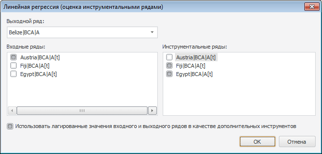
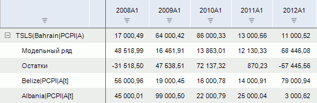
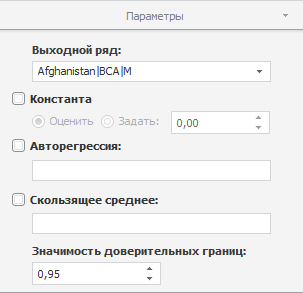

# Линейная регрессия (оценка МИП)

Линейная регрессия (оценка МИП)
-

# Линейная регрессия (МИП)

Метод рассчитывает линейную регрессию с использованием инструментальных
 переменных. Входит в группу «Регрессия».

[Для применения
 метода](javascript:TextPopup(this))

		- Выделите несколько рядов в таблице данных.

		- Выполните команду «Линейная
		 регрессия (МИП)» в раскрывающемся меню кнопки  «Регрессия» на вкладке ленты
		 «Вычисления».

После применения метода будет отображен диалог:

Задайте параметры расчёта метода:

	- Выходной ряд. Укажите
	 ряд, в который будут выгружены результаты;

	- Входные ряды. Отметьте
	 флажками входные ряды, влияющие на моделируемый ряд;

	- Инструментальные
	 ряды. Отметьте флажками входные ряды, используемые для оценки
	 коэффициентов;

	- Использовать лагированные значения
	 входного и выходного рядов в качестве дополнительных инструментов.
	 По умолчанию флажок установлен и при расчёте линейной регрессии лагированные
	 значения объясняемой и объясняющих переменных используются в качестве
	 дополнительных инструментов.

После расчёта в рабочей книге будет создан вычисляемый ряд с наименованием
 вида «TSLS(<Наименование_выходного_ряда>)»,
 содержащий результаты расчета. Например:

## Настройка параметров расчёта. Вкладка «Параметры»

Для настройки параметров расчёта используйте вкладку «Параметры»
 на боковой панели.

[Для отображения
 вкладки](javascript:TextPopup(this))

		- Убедитесь, что боковая панель отображается;

		- Выделите в таблице данных ряд, рассчитанный методом «Линейная регрессия (МИП)»;

		- Установите переключатель «Ряд»
		 на боковой панели;

		- Перейдите на вкладку «Параметры».

Параметры метода:

	- Выходной ряд. Укажите
	 ряд, в который будут выгружены результаты;

	- Константа. Если флажок
	 установлен, то в модели используется константа. Укажите метод расчёта
	 константы:

	-

		- Оценить. Значение
		 константы оценивается автоматически при расчете метода. Полученное
		 значение будет отображено в поле ввода справа;

		- Задать. Значение
		 константы задается пользователем в соответствующем поле;

	- Авторегрессия. По умолчанию
	 флажок снят. Если флажок установлен, то в модели используются коэффициенты
	 авторегрессии;

	- Скользящее среднее.
	 По умолчанию флажок снят. Если флажок установлен, то в модели используются
	 коэффициенты скользящего среднего;

Совет.
 Вводите номера или диапазоны порядка скользящего среднего и авторегрессии,
 разделенные запятыми. Диапазон порядка указывайте через знак «-». Например:
 1-3,5,7-9. В настольном приложении для настройки параметров авторегрессии/скользящего
 среднего используйте вкладку «[Параметры
 оценки ARMA](../Panel_ARMA.htm)» на боковой панели.

	- Значимость доверительных границ.
	 Задайте уровень значимости доверительных границ прогнозного ряда.
	 Диапазон допустимых значений: (0, 1). Значение по умолчанию - «0,95».

Для настройки факторов, используемых в методе, используйте группу вкладок
 «Уравнение» на боковой панели.
 Более подробно см. раздел «[Настройка факторов](../Factors.htm)».

См. также:

[Работа
 с вычисляемыми рядами](../../UiDw_ComputedSeries.htm)
 | [Настройка
 факторов](../Factors.htm) | [Метод
 инструментальных переменных](Lib.chm::/01_Regression_models/UiModelling_LinearRegr_Method_Instr_Var.htm)
 | [IModelling.Tsls](KeMs.chm::/Interface/IModelling/IModelling.Tsls.htm)

		Справочная
		 система на версию 10.9
		 от 18/08/2025,
		 © ООО «ФОРСАЙТ»,
