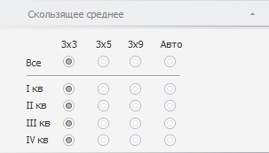
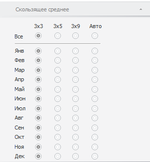

# Настройка параметров скользящего среднего

Настройка параметров скользящего среднего
-

# Настройка параметров скользящего среднего

Для настройки параметров скользящего среднего используйте вкладку «Скользящее среднее» на боковой панели.
 Скользящее среднее применяется для расчета значений на основе среднего
 значения переменной для указанного числа предшествующих периодов.

Примечание.
 Метод X11 поддерживается только в ОС Windows.

[Для отображения
 вкладки](javascript:TextPopup(this))

		- Убедитесь, что боковая панель отображается;

		- Выделите в таблице данных ряд, рассчитанный методом «Выделение сезонности (X11)»;

		- Установите переключатель «Ряд»
		 на боковой панели;

		- Перейдите на вкладку «Скользящее
		 среднее».

Вид вкладки различается в зависимости от календарной динамики исходного
 ряда:

	- квартальная динамика:

	- месячная динамика:

Независимо от календарной динамики вкладка содержит следующие переключатели,
 определяющие метод расчёта скользящего среднего:

	- 3х3. Представляет собой
	 ряд, который получен путём двукратного применения скользящего среднего
	 по трём наблюдениям к заданному ряду. Эта процедура эквивалента взвешенному
	 скользящему среднему по 5 наблюдениям;

	- 3х5. Процедура сглаживания
	 временного ряда, при которой исходный ряд сначала сглаживается по
	 5 соседним точкам, а затем к полученному ряду применяется процедура
	 трехточечного скользящего среднего. Это эквивалентно сглаживанию по
	 7 точкам;

	- 3х9. Процедура сглаживания
	 временного ряда, при которой исходный ряд сначала сглаживается по
	 9 соседним точкам, а затем к полученному ряду применяется процедура
	 трехточечного скользящего среднего;

	- Авто. Метод расчёта
	 скользящего среднего выбирается автоматически.

Установите переключатель, соответствующий методу расчёта скользящего
 среднего, для каждого элемента календарной динамики.

Совет. Для выбора
 метода расчёта сразу для всех элементов календарной динамики установите
 соответствующий переключатель в строке «Все».

См. также:

[Выделение сезонности (X11)](UiDw_cs_Seasonality_Month.htm)
 | [Работа
 с вычисляемыми рядами](../../UiDw_ComputedSeries.htm)

		Справочная
		 система на версию 10.9
		 от 18/08/2025,
		 © ООО «ФОРСАЙТ»,
