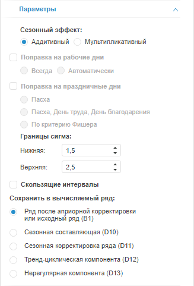

# Настройка параметров выделения сезонности (X11)

Настройка параметров выделения сезонности (X11)
-

# Настройка параметров выделения сезонности (X11)

Для настройки базовых параметров метода «X11»
 используйте вкладку «Параметры»
 на боковой панели.

Примечание.
 Метод X11 поддерживается только в ОС Windows.

[Для отображения
 вкладки](javascript:TextPopup(this))

		- Убедитесь, что боковая панель отображается;

		- Выделите в таблице данных ряд, рассчитанный методом «Выделение сезонности (X11)»;

		- Установите переключатель «Ряд»
		 на боковой панели;

		- Перейдите на вкладку «Параметры».

Параметры метода:

	- Сезонный эффект. Укажите
	 модель, применяемую для выделения сезонной составляющей исходного
	 ряда:

	-

		- Аддитивная. Используется
		 по умолчанию. Ряд рассматривается как сумма систематической и
		 нерегулярной составляющих;

		- Мультипликативная.
		 Ряд рассматривается как произведение систематической и нерегулярной
		 составляющих;

	- Поправка на рабочие дни.
	 Если флажок установлен, то выполняется поправка на рабочие дни. Способы
	 поправки:

	-

		- Всегда. Делается
		 поправка на рабочие дни;

		- Автоматически. Определяется
		 автоматически: делать ли поправку на рабочие дни.

Примечание.
 Поправка на рабочие дни применяется только для месячных данных.

	- Поправка на праздничные дни.
	 Если флажок установлен, то выполняется поправка на праздничные дни.
	 Поправка позволяет повысить точность расчетов. Способы поправки:

	-

		- Пасха;

		- Пасха, День труда, День
		 благодарения;

		- По [критерию
		 Фишера](Lib.chm::/05_Statistics/UiModelling_F_Test.htm).

Примечание.
 Поправка на праздничные дни применяется только для мультипликативной модели
 сезонности, рассчитываемой на месячных данных.

	- Границы сигма. Большинство
	 реальных временных рядов содержит выбросы. Они могут исказить оценки
	 сезонности и тренда. Метод «X11»
	 дает возможность уменьшить влияние выбросов, исключив из рассмотрения
	 значения, выходящие за определённый диапазон, либо преобразовав такие
	 значения.

	Ширина диапазона задаётся нижней и верхней границей сигма в группе
	 параметров «Границы сигма».
	 По умолчанию нижняя граница равна «1,5», верхняя - «2,5»;

	- Скользящие интервалы.
	 Если флажок установлен, то при расчёте используются скользящие интервалы.
	 По умолчанию флажок снят;

	- Сохранить в вычисляемый ряд.
	 Укажите данные, которые будут выгружаться в вычисляемый ряд:

		- Ряд после априорной корректировки или исходный ряд ([B1](Lib.chm::/02_Time_series_analysis/UiModelling_Census1.htm#b01));

		- Сезонная составляющая ([D10](Lib.chm::/02_Time_series_analysis/UiModelling_Census1.htm#d10));

		- Сезонная корректировка ряда ([D11](Lib.chm::/02_Time_series_analysis/UiModelling_Census1.htm#d11));

		- Тренд-циклическая компонента ([D12](Lib.chm::/02_Time_series_analysis/UiModelling_Census1.htm#d12));

		- Нерегулярная компонента ([D13](Lib.chm::/02_Time_series_analysis/UiModelling_Census1.htm#d13)).

См. также:

[Выделение сезонности (X11)](UiDw_cs_Seasonality_Month.htm)
 | [Работа
 с вычисляемыми рядами](../../UiDw_ComputedSeries.htm)

		Справочная
		 система на версию 10.9
		 от 18/08/2025,
		 © ООО «ФОРСАЙТ»,
