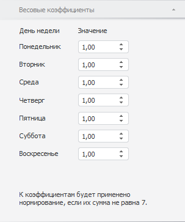

# Задание весовых коэффициентов

Задание весовых коэффициентов
-

# Задание весовых коэффициентов

Месяцы содержат различное число рабочих дней, это может повлиять на
 окончательный результат анализа временного ряда. Метод «X11»
 даёт возможность учесть это обстоятельство введением весовых коэффициентов
 для дней недели.

Примечание.
 Метод X11 поддерживается только в ОС Windows.

Для задания значения весовых коэффициентов для каждого дня недели используйте
 вкладку «Весовые коэффициенты»
 на боковой панели.

[Для отображения
 вкладки](javascript:TextPopup(this))

		- Убедитесь, что боковая панель отображается;

		- Выделите в таблице данных ряд, рассчитанный методом «Выделение сезонности (X11)»;

		- Установите переключатель «Ряд»
		 на боковой панели;

		- Перейдите на вкладку «Весовые
		 коэффициенты».

Задайте значение коэффициента для каждого дня недели. По умолчанию весовые
 коэффициенты равны единице. Если сумма всех коэффициентов не равна семи,
 то к коэффициентам будет применено нормирование по формуле:

Wi=Wi*7/S,

где:

	- Wi.
	 Вес коэффициента;

	- S.
	 Ненормированная сумма.

См. также:

[Выделение сезонности (X11)](UiDw_cs_Seasonality_Month.htm)
 | [Работа
 с вычисляемыми рядами](../../UiDw_ComputedSeries.htm)

		Справочная
		 система на версию 10.9
		 от 18/08/2025,
		 © ООО «ФОРСАЙТ»,
