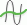
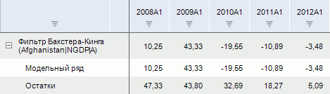
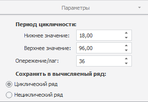

# Фильтр Бакстера-Кинга

Фильтр Бакстера-Кинга
-

# Фильтр Бакстера-Кинга

Применяет к значениям ряда метод «Фильтр
 Бакстера-Кинга». Входит в группу «Сглаживание».

Фильтр Бакстера-Кинга - это метод сглаживания временного ряда,
 который является модификацией фильтра Ходрика-Прескотта, с более широкими
 возможностями исключения циклической составляющей из временного ряда.

[Для применения
 метода](javascript:TextPopup(this))

		- Выделите один или несколько рядов в таблице данных;

		- Выполните команду «Фильтр
		 Бакстера-Кинга» в раскрывающемся меню кнопки «Сглаживание»
		  на вкладке ленты «Вычисления».

После применения метода в рабочей книге на основе каждого выделенного
 ряда будет создан вычисляемый ряд с наименованием вида «Фильтр
 Бакстера-Кинга(<Имя_Ряда>)», содержащий результаты расчета.
 Например:

## Настройка параметров расчёта. Вкладка «Параметры»

Для настройки параметров расчёта используйте вкладку «Параметры»
 на боковой панели.

[Для отображения
 вкладки](javascript:TextPopup(this))

		- Убедитесь, что боковая панель отображается;

		- Выделите в таблице данных ряд, рассчитанный методом «Фильтр Бакстера-Кинга»;

		- Установите переключатель «Ряд»
		 на боковой панели;

		- Перейдите на вкладку «Параметры».

Параметры метода:

	- Период цикличности.
	 Укажите значения верхней и нижней границ периода цикличности.

		- Значения опережения/лага и границ периода цикличности устанавливаются
		 в зависимости от календарной динамики ряда. Значения по умолчанию:

		 Динамика
		 Опережение/лаг
		 Нижнее значение
		 Верхнее значение

		 Годовая
		 3
		 2
		 8

		 Полугодовая
		 6
		 3
		 16

		 Квартальная
		 12
		 6
		 32

		 Месячная
		 36
		 18
		 96

		 Недельная
		 156
		 78
		 416

		 Дневная (в неделе 5 дней)
		 783
		 391,5
		 2088

		 Дневная (в неделе 7 дней)
		 1095
		 547,5
		 2920

	- Опережение/лаг. Задайте
	 размер интервала, на котором рассчитывается скользящее среднее;

	- Сохранить в вычисляемый ряд.
	 Выберите ряд, значения которого будут содержаться в результирующем
	 ряде данных.

См. также:

[Работа
 с вычисляемыми рядами](../../UiDw_ComputedSeries.htm) | Метод «[Фильтр
 Бакстера-Кинга](Lib.chm::/02_Time_series_analysis/UiModelling_BaxterKingFilter.htm)» | Контейнер моделирования: модель
 «[Фильтр
 Бакстера-Кинга](UiModelling.chm::/2_Container_of_Modeling/2_3_Work_object/2_3_2_Model/Specification/UiModelling_Specification_BaxterKingFilter.htm)» | [IModelling.Bpf](KeMs.chm::/Interface/IModelling/IModelling.Bpf.htm)

		Справочная
		 система на версию 10.9
		 от 18/08/2025,
		 © ООО «ФОРСАЙТ»,
