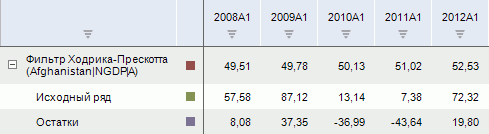
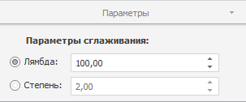

# Фильтр Ходрика-Прескотта

Фильтр Ходрика-Прескотта
-

# Фильтр Ходрика-Прескотта

Применяет к значениям ряда метод «Фильтр
 Ходрика-Прескотта». Входит в группу «Сглаживание».

Фильтр Ходрика-Прескотта - это метод сглаживания временного ряда, который
 используется для выделения длительных тенденций.

[Для применения
 метода](javascript:TextPopup(this))

		- Выделите один или несколько рядов в таблице данных;

		- Выполните команду «Фильтр
		 Ходрика-Прескотта» в раскрывающемся меню кнопки «Сглаживание» 
		 на вкладке ленты «Вычисления».

После применения метода в рабочей книге на основе каждого выделенного
 ряда будет создан вычисляемый ряд с наименованием вида «Фильтр
 Ходрика-Прескотта(<Имя_Ряда>)», содержащий результаты расчета.
 Например:

## Настройка параметров расчёта. Вкладка «Параметры»

Для настройки параметров расчёта используйте вкладку «Параметры»
 на боковой панели.

[Для отображения
 вкладки](javascript:TextPopup(this))

		- Убедитесь, что боковая панель отображается;

		- Выделите в таблице данных ряд, рассчитанный методом «Фильтр Ходрика-Прескотта»;

		- Установите переключатель «Ряд»
		 на боковой панели;

		- Перейдите на вкладку «Параметры».

Параметры метода:

	- Параметр сглаживания.
	 Управляет мерой гладкости ряда. Чем больше значение параметра, тем
	 более гладким получается ряд. Если значение параметра сглаживания
	 стремится к бесконечности, то ряд превращается в линейный тренд. Переключатели
	 определяют способ задания параметра сглаживания:

	-

		- Лямбда. Параметр
		 сглаживания определяется значением лямбды. Значение по умолчанию
		 - «100»;

		- Степень. Параметр
		 сглаживания определяется значением степени, которое должно быть
		 больше нуля. Значение по умолчанию - «4».

См. также:

[Работа
 с вычисляемыми рядами](../../UiDw_ComputedSeries.htm) | Метод «[Фильтр
 Ходрика-Прескотта](Lib.chm::/02_Time_series_analysis/UiModelling_HodrickPrescottFilter.htm)» | Контейнер моделирования:
 модель «[Фильтр
 Ходрика-Прескотта](UiModelling.chm::/2_Container_of_Modeling/2_3_Work_object/2_3_2_Model/Specification/10_Filter_Hodrika_Preskotta/10_filter_hordrika_preskotta.htm)» | [IModelling.Hpf](KeMs.chm::/Interface/IModelling/IModelling.Hpf.htm)
 | [IModelling.Hpfp](KeMs.chm::/Interface/IModelling/IModelling.Hpfp.htm)

		Справочная
		 система на версию 10.9
		 от 18/08/2025,
		 © ООО «ФОРСАЙТ»,
