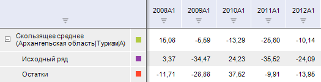

# Скользящее среднее

Скользящее среднее
-

# Скользящее среднее

Применяет к значениям ряда метод «Скользящее
 среднее». Входит в группу «Сглаживание».

Метод скользящего среднего основан на представлении ряда в виде суммы
 достаточно гладкого тренда и случайной компоненты. В основе метода лежит
 идея локального приближения тренда полиномом не очень высокой степени.

[Для применения
 метода](javascript:TextPopup(this))

		- Выделите один или несколько рядов в таблице данных.

		- Выполните команду «Скользящее
		 среднее» в раскрывающемся меню кнопки  «Сглаживание» на вкладке ленты
		 «Вычисления».

После применения метода в рабочей книге на основе каждого выделенного
 ряда будет создан вычисляемый ряд с наименованием вида «Скользящее
 среднее(<Имя_Ряда>)», содержащий результаты расчета. Например:

## Настройка параметров расчёта

Для настройки параметров расчёта используйте вкладку «Параметры»
 на боковой панели.

[Для отображения
 вкладки](javascript:TextPopup(this))

		- Убедитесь, что боковая панель отображается.

		- Выделите в таблице данных ряд, рассчитанный методом «Скользящее среднее».

		- Установите переключатель «Ряд»
		 на боковой панели.

		- Перейдите на вкладку «Параметры».

Параметры метода:

	- Размер окна. Интервал
	 времени, на котором рассчитывается среднее значение элементов. Чем
	 больше размер окна, тем более «гладкий» получается ряд. По умолчанию
	 размер окна - «5».

	Если размер окна больше числа наблюдений ряда, то расчет прерывается.
	 Вычисляемый ряд будет заполнен пустыми значениями, и в ячейке с заголовком
	 будет отображен красный уголок со всплывающей подсказкой: «Размер
	 окна должен быть не больше числа наблюдений»;

	- Центрировать скользящее среднее.
	 Если флажок установлен, то для расчёта сглаженных значений применяется
	 метод центрирования. Метод актуально использовать при четном размере
	 окна.

См. также:

[Работа
 с вычисляемыми рядами](../../UiDw_ComputedSeries.htm) | [Метод
 скользящего среднего](Lib.chm::/02_Time_series_analysis/UiModelling_SlideSmooth.htm) | Контейнер моделирования: модель
 «[Скользящее
 среднее](UiModelling.chm::/2_Container_of_Modeling/2_3_Work_object/2_3_2_Model/Specification/2_Slitherring_smoothing/2_Slitherring_smoothing.htm)» | [IModelling.Movavg](KeMs.chm::/Interface/IModelling/IModelling.Movavg.htm)

		Справочная
		 система на версию 10.9
		 от 18/08/2025,
		 © ООО «ФОРСАЙТ»,
