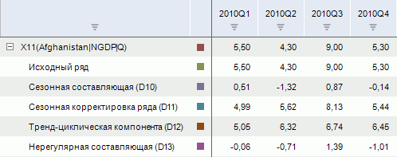

# Выделение сезонности (X11)

Выделение сезонности (X11)
-

# Выделение сезонности (X11)

Выполняются сезонная декомпозиция и корректировка месячных/квартальных
 данных методом «X11». Производится
 разложение исходного ряда на сезонную, тренд-циклическую и нерегулярную
 составляющие, выявляет сезонную корректировку. Входит в группу «Сглаживание».

[Для применения
 метода](javascript:TextPopup(this))

		- В таблице данных выделите один или несколько рядов, имеющих
		 месячную/квартальную динамику;

		- Выполните команду «Выделение
		 сезонности (X11)» в раскрывающемся меню кнопки «Сглаживание»
		  на вкладке ленты «Вычисления».

После применения метода в рабочей книге на основе каждого выделенного
 ряда будет создан вычисляемый ряд с наименованием вида «X11(<Имя_Ряда>)»,
 содержащий результаты расчета. Например:

Если сглаживаемый ряд не имеет квартальной/месячной динамики, то расчет
 прерывается. Вычисляемый ряд будет заполнен пустыми значениями, и в ячейке
 с заголовком будет отображен красный уголок со всплывающей подсказкой:
 «Метод X11 доступен только на месячной
 или квартальной динамике».

Примечание.
 Метод X11 поддерживается только в ОС Windows.

## Настройка параметров расчёта

Для настройки специфических параметров расчёта используйте вкладки на
 боковой панели:

	- [Параметры](Panel_Param_x11.htm).
	 Позволяет изменить базовые параметры расчёта: применяемую модель сезонности,
	 применяемые поправки и т.д.;

	- [Скользящее
	 среднее](Panel_MA.htm). Позволяет задать метод расчёта скользящего среднего
	 для каждого элемента календарной динамики исходного ряда;

	- [Весовые
	 коэффициенты](Panel_Weigth.htm). Позволяет задать весовые коэффициенты для
	 дней недели.

См. также:

[Работа
 с вычисляемыми рядами](../../UiDw_ComputedSeries.htm) | Метод «[X11](Lib.chm::/02_Time_series_analysis/UiModelling_Census2.htm)»
 | Контейнер моделирования: модель «[X11](UiModelling.chm::/2_Container_of_Modeling/2_3_Work_object/2_3_2_Model/Specification/UiModelling_Specification_Census2.htm)» |
 [IModelling.X11](KeMs.chm::/Interface/IModelling/IModelling.X11.htm)

		Справочная
		 система на версию 10.9
		 от 18/08/2025,
		 © ООО «ФОРСАЙТ»,
