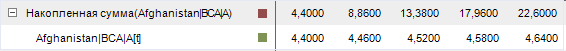

# Методы накопления

Методы накопления
-

# Методы накопления

Накопление - метод расчета, при котором расчет значения точки вычисляемого
 ряда с порядковым номером n происходит
 на диапазоне значений дочернего ряда: [Первый
 элемент ряда; n элемент ряда]. Методы накопления входят в группу
 методов, осуществляющих преобразования над рядами.

В инструменте анализа временных рядов доступны следующие методы накопления:

	- Накопленный минимум.
	 Используется метод накопления «Минимум»:
	 определяется минимальное значение элементов диапазона;

	- Накопленная медиана.
	 Используется метод накопления «Медиана»:
	 определяется медиана значений элементов диапазона;

	- Накопленный максимум.
	 Используется метод «Максимум»:
	 определяется максимальное значение элементов диапазона;

	- Накопленное среднее.
	 Используется метод «Среднее»:
	 определяется среднее значение элементов диапазона;

	- Накопленное стандартное отклонение.
	 Используется метод «Стандартное
	 отклонение»: определяется стандартное отклонение значений элементов
	 диапазона;

	- Накопленная сумма. Используется
	 метод «Сумма»: определяется
	 сумма значений элементов диапазона;

	- Накопленное умножение.
	 Используется метод «Произведение»:
	 определяется произведение значений элементов диапазона.

[Для применения
 метода](javascript:TextPopup(this))

		- Выделите один или несколько рядов в таблице данных;

		- Выполните команду «Методы
		 накопления > <Метод>» в раскрывающемся меню
		 кнопки  «Преобразования»
		 на вкладке ленты «Вычисления».

После применения метода в рабочей книге на основе каждого выделенного
 ряда будет создан вычисляемый ряд с наименованием вида «<Наименование_функции>(<Имя_Ряда>)»,
 содержащий результаты расчета. Например:

См. также:

[Работа
 с вычисляемыми рядами](../../UiDw_ComputedSeries.htm) | Контейнер моделирования: модель «[Методы
 накопления](UiModelling.chm::/2_Container_of_Modeling/2_3_Work_object/2_3_2_Model/Specification/UiModelling_Specification_Cumulative.htm)» | [IModelling.Cumulative](KeMs.chm::/Interface/IModelling/IModelling.Cumulative.htm)
 | [IModelling.Cumulativeytd](KeMs.chm::/Interface/IModelling/IModelling.Cumulativeytd.htm)

		Справочная
		 система на версию 10.9
		 от 18/08/2025,
		 © ООО «ФОРСАЙТ»,
