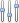
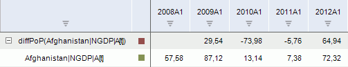

# Разность

Разность
-

# Разность

Метод осуществляет преобразование y[t]
 = x[t] – x[t-N] за определенный период:

	- diff PoP. Предыдущий
	 период;

	- diff YoY. Соответствующий
	 период предыдущего года;

	- diff YTD. Конец предыдущего
	 года.

Входит в группу методов, осуществляющих преобразования над рядами.

[Для применения
 метода](javascript:TextPopup(this))

		- Выделите один или несколько рядов в таблице данных;

		- Выполните команду «Математические >
		 Разность (diff <Период>)» в раскрывающемся меню кнопки
		  «Преобразования»
		 на вкладке ленты «Вычисления».

После применения метода в рабочей книге на основе каждого выделенного
 ряда будет создан вычисляемый ряд с наименованием вида «diff<Период>(<Имя_Ряда>[t])(<Имя_Ряда>)»,
 содержащий результаты расчета. Например:

См. также:

[Работа
 с вычисляемыми рядами](../../UiDw_ComputedSeries.htm) | Контейнер моделирования: [Преобразования
 над переменными или факторами](UiModelling.chm::/2_Container_of_Modeling/2_3_Work_object/UiModelling_work_Changes.htm) | [IModelling.Diff](KeMs.chm::/Interface/IModelling/IModelling.Diff.htm)
 | [IModelling.Diffx](KeMs.chm::/Interface/IModelling/IModelling.Diffx.htm)
 | [IModelling.Diffy](KeMs.chm::/Interface/IModelling/IModelling.Diffy.htm)

		Справочная
		 система на версию 10.9
		 от 18/08/2025,
		 © ООО «ФОРСАЙТ»,
