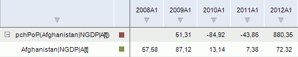

# Темп прироста

Темп прироста
-

# Темп прироста

Метод рассчитывает темп прироста в процентах значений ряда к значениям
 выбранного периода (X[t]/X[t-N]-1)*100:

	- pch PoP. Предыдущий
	 период;

	- pch YoY. Соответствующий
	 период предыдущего года;

	- pch YTD. Конец предыдущего
	 года.

Входит в группу методов, осуществляющих преобразования над рядами.

[Для применения
 метода](javascript:TextPopup(this))

		- Выделите один или несколько рядов в таблице данных;

		- Выполните команду «Математические >
		 Темп прироста (pch <Период>)» в раскрывающемся меню
		 кнопки  «Преобразования»
		 на вкладке ленты «Вычисления».

После применения метода в рабочей книге на основе каждого выделенного
 ряда будет создан вычисляемый ряд с наименованием вида «pch<Период>(<Имя_Ряда>[t])(<Имя_Ряда>)»,
 содержащий результаты расчета. Например:

См. также:

[Работа
 с вычисляемыми рядами](../../UiDw_ComputedSeries.htm) | Контейнер моделирования: [Преобразования
 над переменными или факторами](UiModelling.chm::/2_Container_of_Modeling/2_3_Work_object/UiModelling_work_Changes.htm) | [IModelling.Pch](KeMs.chm::/Interface/IModelling/IModelling.Pch.htm)
 | [IModelling.Pcha](KeMs.chm::/Interface/IModelling/IModelling.Pcha.htm) |
 [IModelling.Pchx](KeMs.chm::/Interface/IModelling/IModelling.Pchx.htm)
 | [IModelling.Pchy](KeMs.chm::/Interface/IModelling/IModelling.Pchy.htm)

		Справочная
		 система на версию 10.9
		 от 18/08/2025,
		 © ООО «ФОРСАЙТ»,
