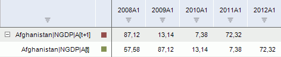
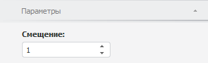

# Опережение

Опережение
-

# Опережение

Метод сдвигает ряд назад на заданное количество точек во временном периоде.
 Входит в группу методов, осуществляющих преобразования над рядами.

[Для применения
 метода](javascript:TextPopup(this))

		- Выделите один или несколько рядов в таблице данных;

		- Выполните команду «Временные >
		 Опережение» в раскрывающемся меню кнопки  «Преобразования» на вкладке ленты
		 «Вычисления».

После применения метода в рабочей книге на основе каждого выделенного
 ряда будет создан вычисляемый ряд с наименованием вида «<Имя_Ряда>[t+<Значение_сдвига>]»,
 содержащий результаты расчета. Например:

## Настройка параметров расчёта. Вкладка «Параметры»

Для настройки параметров расчёта используйте вкладку «Параметры»
 на боковой панели.

[Для отображения
 вкладки](javascript:TextPopup(this))

		- Убедитесь, что боковая панель отображается;

		- Выделите в таблице данных ряд, рассчитанный методом «Опережение»;

		- Установите переключатель «Ряд»
		 на боковой панели;

		- Перейдите на вкладку «Параметры».

Параметры метода:

	- Смещение. Укажите значение
	 временного сдвига. Сдвиг может принимать только положительные значения.
	 По умолчанию значение сдвига равняется единице.

См. также:

[Работа
 с вычисляемыми рядами](../../UiDw_ComputedSeries.htm) | [IModelling.Lead](KeMs.chm::/Interface/IModelling/IModelling.Lead.htm)

		Справочная
		 система на версию 10.9
		 от 18/08/2025,
		 © ООО «ФОРСАЙТ»,
