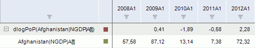

# Разность логарифмов

Разность логарифмов
-

# Разность логарифмов

Метод рассчитывает разность логарифмов соседних точек ряда за определенный
 период (ln(x[t]/X[t-N])):

	- dlog PoP. Предыдущий
	 период;

	- dlog YoY. Соответствующий
	 период предыдущего года;

	- dlog YTD. Конец предыдущего
	 года.

Входит в группу методов, осуществляющих преобразования над рядами.

[Для применения
 метода](javascript:TextPopup(this))

		- Выделите один или несколько рядов в таблице данных;

		- Выполните команду «Математические >
		 Разность логарифмов (dlog
		 <Период>)» в раскрывающемся меню кнопки  «Преобразования» на вкладке ленты
		 «Вычисления».

После применения метода в рабочей книге на основе каждого выделенного
 ряда будет создан вычисляемый ряд с наименованием вида «dlog<Период>(<Имя_Ряда>[t])(<Имя_Ряда>)»,
 содержащий результаты расчета. Например:

См. также:

[Работа
 с вычисляемыми рядами](../../UiDw_ComputedSeries.htm) | Контейнер моделирования: [Преобразования
 над переменными или факторами](UiModelling.chm::/2_Container_of_Modeling/2_3_Work_object/UiModelling_work_Changes.htm) | [IModelling.DLog](KeMs.chm::/Interface/IModelling/IModelling.DLog.htm)
 | [IModelling.DLogx](KeMs.chm::/Interface/IModelling/IModelling.DLogx.htm)

		Справочная
		 система на версию 10.9
		 от 18/08/2025,
		 © ООО «ФОРСАЙТ»,
