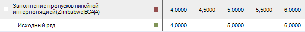
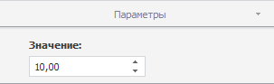

# Методы заполнения пропусков

Методы заполнения пропусков
-

# Методы заполнения пропусков

Обработка пропусков заполняет пустые значения ряда с помощью различных
 методов обработки пропусков. Методы входят в группу методов, осуществляющих
 преобразования над рядами.

В инструменте анализа временных рядов доступны следующие методы:

	- Геометрическая интерполяция.
	 Для вычисления пустых значений ряда используется геометрическая интерполяция;

	- Интерполяция кубическим сплайном.
	 Для вычисления пустых значений ряда используется интерполяция кубическими
	 сплайнами;

	- Линейная интерполяция.
	 Для вычисления пустых значений ряда используется линейная интерполяция
	 по двум соседним точкам;

	- Линейный тренд. Для
	 вычисления пустых значений ряда используется линейный тренд;

	- Предыдущее значение.
	 Пустые значения ряда заменяются предыдущим непустым значением;

	- Следующее значение.
	 Пустые значения ряда заменяются следующим непустым значением;

	- Среднее значение по выборке.
	 Пустые значения ряда вычисляются как среднее по выборке;

	- Среднее по N соседним точкам.
	 Пустые значения ряда вычисляются как среднее по N
	 соседним точкам. Количество соседних точек (N)
	 можно задать на вкладке «Параметры»
	 на боковой панели;

	- Темп роста к предыдущему периоду.
	 Пустые значения ряда вычисляются исходя из темпа роста существующих
	 значений к предыдущему периоду. Количество периодов можно задать на
	 вкладке «Параметры» на боковой
	 панели;

	- Темп роста к следующему периоду.
	 Пустые значения ряда вычисляются исходя из темпа роста существующих
	 значений к следующему периоду. Количество периодов можно задать на
	 вкладке «Параметры» на боковой
	 панели;

	- Указанное значение.
	 Пустые значения ряда заменяются числом, указанным на вкладке «Параметры» на боковой панели.

Примечание.
 Методы «Линейный тренд», «Среднее значение по выборке», «Среднее по N соседним точкам» доступны
 только в настольном приложении.

[Для применения
 метода](javascript:TextPopup(this))

		- Выделите один или несколько рядов в таблице данных;

		- Выполните команду «Методы
		 заполнения пропусков > <Метод>» в раскрывающемся
		 меню кнопки  «Преобразования» на вкладке ленты
		 «Вычисления».

После применения метода в рабочей книге на основе каждого выделенного
 ряда будет создан вычисляемый ряд с наименованием вида «<Наименование_метода>(<Имя_Ряда>)»,
 содержащий результаты расчета. Например:

## Настройка параметров расчёта. Вкладка «Параметры»

Для настройки параметров метода заполнения пропусков используйте вкладку
 «Параметры» на боковой панели.

[Для отображения
 вкладки](javascript:TextPopup(this))

		- Убедитесь, что боковая панель отображается;

		- Выделите в таблице данных ряд, рассчитанный методом заполнения
		 пропусков;

		- Установите переключатель «Ряд»
		 на боковой панели;

		- Перейдите на вкладку «Параметры».

Задайте значение параметра. Вычисляемый ряд будет заново рассчитан.

См. также:

[Работа
 с вычисляемыми рядами](../../UiDw_ComputedSeries.htm) | [Методы
 обработки пропусков](Lib.chm::/03_Transformations/UiModelling_Fill_Gaps.htm) | Контейнер моделирования: модель
 «[Заполнение
 пропусков](UiModelling.chm::/2_Container_of_Modeling/2_3_Work_object/2_3_2_Model/Specification/UiModelling_Specification_Working_Lost.htm)» | [IModelling.Fill](KeMs.chm::/Interface/IModelling/IModelling.Fill.htm)

		Справочная
		 система на версию 10.9
		 от 18/08/2025,
		 © ООО «ФОРСАЙТ»,
