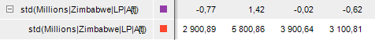

# Статистические

Статистические
-

# Статистические

Статистические методы входят в группу методов, осуществляющих преобразования
 над рядами.

В инструменте анализа временных рядов доступны следующие методы:

	- Нормализация. Осуществляет
	 нормализацию точек ряда: X[t]/σ(X),
	 где σ -[среднеквадратическое
	 отклонение](Lib.chm::/05_Statistics/UiModelling_ArgSqDev.htm) ряда;

	- Стандартизация. Осуществляет
	 стандартизацию точек ряда: (X[t]-M(X))/σ(X),
	 где σ - [среднеквадратическое
	 отклонение](Lib.chm::/05_Statistics/UiModelling_ArgSqDev.htm) ряда, M
	 - [среднее
	 значение](Lib.chm::/05_Statistics/UiModelling_Avg.htm)
	 ряда.

[Для применения
 метода](javascript:TextPopup(this))

		- Выделите один или несколько рядов в таблице данных.

		- Выполните команду «Статистические >
		 <Метод>» в раскрывающемся меню кнопки  «Преобразования» на вкладке ленты
		 «Вычисления».

После применения метода в рабочей книге на основе каждого выделенного
 ряда будет создан вычисляемый ряд. Формат наименования ряда для метода
 «Нормализация» - «norm(<Имя_Ряда>[t])»,
 для метода «Стандартизация» -
 «std(<Имя_Ряда>[t])». Например:

См. также:

[Работа
 с вычисляемыми рядами](../../UiDw_ComputedSeries.htm) | Моделирование и прогнозирование: [Преобразования
 над переменными или факторами](UiModelling.chm::/2_Container_of_Modeling/2_3_Work_object/UiModelling_work_Changes.htm)

		Справочная
		 система на версию 10.9
		 от 18/08/2025,
		 © ООО «ФОРСАЙТ»,
