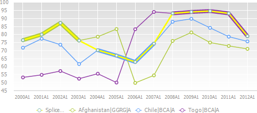
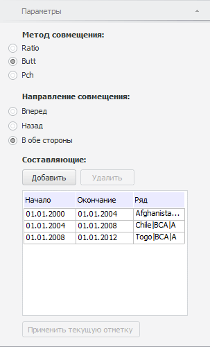
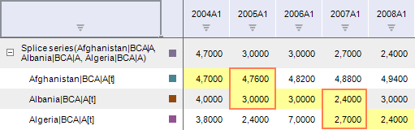

# Совмещение

Совмещение
-

# Совмещение

Метод входит в группу «Преобразования»
 и предназначен для совмещения нескольких рядов целиком или их частей.
 Результирующий ряд будет состоять из значений исходных рядов, совмещенных
 по заданным параметрам.

Примечание.
 Совместить можно только ряды/части рядов с одинаковой календарной динамикой.

[Для применения
 метода](javascript:TextPopup(this))

		- В таблице данных выделите ряды/части рядов, которые необходимо
		 совместить. Для выделения частей нескольких рядов зажмите клавишу
		 CTRL;

		- Выполните команду «Временные >
		 Совмещение» в раскрывающемся меню кнопки  «Преобразования» на вкладке ленты
		 «Вычисления».

После применения метода в рабочей книге на основе выделенных рядов
 будет создан вычисляемый ряд с наименованием вида «Splice
 series(<Список_Совмещенных_Рядов>)», содержащий результаты
 совмещения. Для данного ряда дочерними являются совмещаемые ряды. Наблюдения
 дочерних рядов, которые участвовали в совмещении, подсвечиваются.

Диаграмма для вычисляемого ряда «Splice
 series» отличается от стандартной:

На диаграмме обычными линиями отображаются дочерние ряды совмещенного
 ряда. Жирными линиями отображаются области рядов, образующих совмещенный
 ряд. Сам совмещенный ряд отображается полужирной линией того же цвета,
 что и подсветка ячеек в таблице данных.

## Настройка параметров расчёта

[Добавление наблюдений
 в совмещаемую область](javascript:TextPopup(this))

	Примечание.
	 Возможность доступна только в настольном приложении.

		- В таблице данных выделите наблюдения дочернего ряда, которые
		 необходимо добавить в совмещение;

		- Выполните команду «Добавить
		 к Splice» в контекстном меню.

	Выделенные наблюдения будут добавлены в совмещение.

[Исключение наблюдений
 из совмещаемой области](javascript:TextPopup(this))

	Примечание.
	 Возможность доступна только в настольном приложении.

		- В таблице данных выделите наблюдения дочернего ряда, которые
		 необходимо исключить из совмещения;

		- Выполните команду «Удалить
		 из Splice» в контекстном меню.

	Выделенные наблюдения будут исключены из совмещения.

Для настройки специфических параметров расчёта используйте вкладку «Параметры» на боковой панели.

### Вкладка «Параметры»

[Для отображения
 вкладки](javascript:TextPopup(this))

		- Убедитесь, что боковая панель отображается;

		- Выделите в таблице данных ряд, рассчитанный методом «Совмещение»;

		- Установите переключатель «Ряд»
		 на боковой панели;

		- Перейдите на вкладку «Параметры».

Параметры метода:

	- Метод совмещения. Доступные
	 методы:

	-

		- Ratio. Совмещение
		 данных с темпами роста. Для использования метода совмещаемые области
		 рядов должны пересекаться. Например, на рисунке выделены пересекающиеся
		 области:

	-

		- Butt. Используется
		 по умолчанию. Совмещение без преобразования данных. Первая часть
		 результирующего ряда будет состоять из значений первой области
		 до точки, являющейся началом второй области; вторая часть результирующего
		 ряда - из значений второй области до точки, являющейся началом
		 третей области и т.д.;

		- Pch. Совмещение
		 данных с темпами прироста;

	- Направление совмещения.
	 Укажите метод определения точки совмещения ряда. Пусть есть ряд Y=[Yt1,Yt2,Yt3,Yt4,Yt5] и ряд X=[Xt2,Xt3,Xt4]. Совмещение Y и X
	 может быть следующих типов:

	-

		- Вперед. Прибавление
		 идет в конец ряда X.
		 Результирующий ряд Z=[Xt2,Xt3,Xt4,Yt5].
		 Направление недоступно, если выбран метод совмещения «Ratio»;

		- Назад. Прибавление
		 идет в начале ряда X.
		 Результирующий ряд Z=[Yt1,Xt2,Xt3,Xt4].
		 Направление недоступно, если выбран метод совмещения «Ratio»;

		- В обе стороны. Используется
		 по умолчанию. Прибавление идет с обеих сторон для ряда X.
		 Результирующий ряд Z=[Yt1,Xt2,Xt3,Xt4,Yt5];

	- Составляющие. В таблице
	 приведены области рядов, участвующие в совмещении. Даты начала, окончания
	 совмещения и наименование ряда указаны в соответствующих столбцах.

[Изменение
 области совмещения](javascript:TextPopup(this))

	Примечание.
	 Возможность доступна только в настольном приложении.

	Для изменения даты начала/окончания области
	 совмещения:

		-

			- Дважды щелкните по требуемой ячейке в столбце «Начало»/«Окончание».
			 Дата будет переведена в режим редактирования.

			- Введите требуемое значение и щёлкните за пределами
			 ячейки.

	Для изменения совмещаемого ряда:

		-

			- Дважды щелкните по требуемой ячейке в столбце «Ряд». Будет отображен список
			 совмещаемых рядов.

			- Выберите требуемый ряд и щёлкните за пределами
			 ячейки.

[Добавление
 области ряда в совмещение](javascript:TextPopup(this))

			- Нажмите кнопку «Добавить».
			 В таблицу будет добавлена новая область совмещения;

			- В соответствующей ячейке в столбце «Ряд»
			 выберите совмещаемый ряд;

			- В соответствующих ячейках в столбцах «Начало»
			 /«Окончание» задайте
			 даты начала/окончания совмещаемой области;

			- щёлкните за пределами списка областей совмещения.

	Вычисляемый ряд будет перестроен в соответствии
	 с заданными параметрами.

[Удаление
 области ряда из совмещения](javascript:TextPopup(this))

	Выберите необходимую область и нажмите
	 на кнопку «Удалить». Удаление
	 выполняется без запроса подтверждения выполняемого действия.

	Вычисляемый ряд будет перестроен.

	- Применить текущую отметку.
	 Позволяет изменить исходные области рядов, на основании которых осуществляется
	 совмещение. Старые области рядов полностью будут замены на новые.

[Порядок
 применения](javascript:TextPopup(this))

		-

			- [Заблокируйте
			 вычисляемый ряд](../../UiDw_ComputedSeries.htm#block);

			- В таблице данных выделите новые совмещаемые области;

			- Нажмите кнопку «Применить
			 текущую отметку»;

			- Снимите блокировку вычисляемого ряда.

	Вычисляемый ряд будет заново рассчитан.

См. также:

[Работа
 с вычисляемыми рядами](../../UiDw_ComputedSeries.htm) | [IModelling.Splice](KeMs.chm::/Interface/IModelling/IModelling.Splice.htm)
 | [IModelling.Splicep](KeMs.chm::/Interface/IModelling/IModelling.Splicep.htm)

		Справочная
		 система на версию 10.9
		 от 18/08/2025,
		 © ООО «ФОРСАЙТ»,
