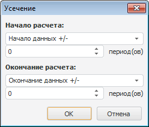
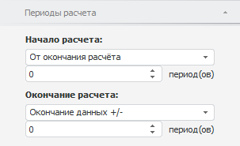

# Усечение

Усечение
-

# Усечение

Метод усекает ряд по заданным параметрам. Входит в группу методов, осуществляющих
 преобразования над рядами.

[Для применения
 метода](javascript:TextPopup(this))

		- Выделите один или несколько рядов в таблице данных.

		- Выполните команду «Временные >
		 Усечение» в раскрывающемся меню кнопки 
		 «Преобразования» на вкладке
		 «Вычисления» ленты инструментов.

После применения метода будет отображен диалог «Усечение»:

Задайте в окне следующие параметры:

[Начало расчета](javascript:TextPopup(this))

	Определите начальную точку периода расчета. Для этого в раскрывающемся
	 списке выберите способ расчета даты начала периода:

		- Начало данных +/-.
		 Дата начала периода расчета равна первой фактической дате входного
		 ряда плюс число периодов, указанных в редакторе чисел;

		- Определенная дата.
		 Дата начала периода расчета равна дате, указанной в редакторе
		 дат;

		- Сегодня +/-. Дата
		 начала периода расчета равна текущей дате плюс число периодов,
		 указанных в редакторе чисел;

		- От окончания расчета.
		 Дата начала периода расчета равна дате окончания периода расчета
		 минус число периодов, указанных в редакторе чисел.

[Окончание расчета](javascript:TextPopup(this))

	Определите конечную точку периода расчета. Для этого в раскрывающемся
	 списке выберите способ расчета даты окончания периода:

		- Конец периода отображения.
		 Дата окончания расчета равна дате окончания периода отображения
		 данных в рабочей книге;

		- Определенная дата.
		 Дата окончания расчета равна дате, указанной в редакторе дат;

		- Окончание данных +/-.
		 Дата окончания расчета равна последней фактической дате входного
		 ряда плюс число периодов, указанных в редакторе чисел;

		- Сегодня +/-. Дата
		 окончания расчета равна текущей дате плюс число периодов, указанных
		 в редакторе чисел;

		- От начала расчета.
		 Дата окончания расчета равна дате начала расчета плюс число периодов,
		 указанных в редакторе чисел.

После применения метода в рабочей книге на основе каждого выделенного
 ряда будет создан вычисляемый ряд с наименованием вида «Truncate(<Имя_Ряда>)»,
 содержащий результаты усечения. Например:

## Настройка параметров расчёта. Вкладка «Периоды расчета»

Для настройки параметров расчёта используйте вкладку «Периоды
 расчета» на боковой панели.

[Для отображения
 вкладки](javascript:TextPopup(this))

		- Убедитесь, что боковая панель отображается.

		- Выделите в таблице данных ряд, рассчитанный методом «Усечение».

		- Установите переключатель «Ряд»
		 на боковой панели.

		- Перейдите на вкладку «Периоды
		 расчета».

Все настройки на данной вкладке аналогичны настройкам в диалоге «Усечение», описанном выше.

См. также:

[Работа
 с вычисляемыми рядами](../../UiDw_ComputedSeries.htm) | [IModelling.Truncate](KeMs.chm::/Interface/IModelling/IModelling.Truncate.htm)

		Справочная
		 система на версию 10.9
		 от 18/08/2025,
		 © ООО «ФОРСАЙТ»,
