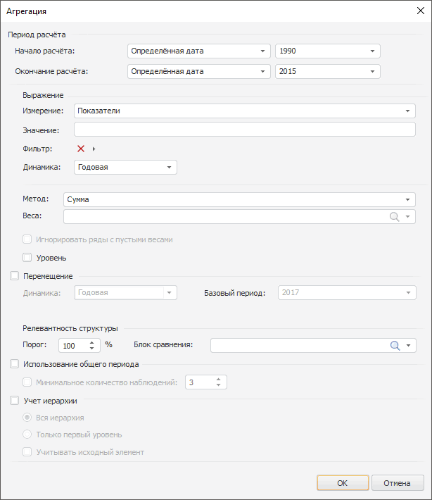

# Пример настройки расчета агрегации

Пример настройки расчета агрегации
-

# Пример настройки расчета агрегации

В примере рассмотрена настройка расчета агрегации. Агрегация будет рассчитываться
 по следующему выражению: «Rebase(Level(Сумма((BCA[t]
 + BCI[t]) * (BDS[t]))), 01.01.2001)» - взвешенная сумма показателей
 «BCA» и «BCI»
 для указанных стран, веса заданы рядом «BDS».
 Используются функции «Rebase»
 и «Level». Измерение показателей
 называется «Показатели», измерение
 стран - «Страны».

Для настройки агрегации на панели моделирования во всплывающем меню
 «Агрегация» выполните команду
 «Агрегация». Будет отображено
 окно:

В данном диалоге укажите следующие параметры агрегации:

	- Измерение. Выберите
	 измерение «Показатели»;

	- Значение. Введите выражение
	 «{BCA}+{BCI}»;

	- Фильтр. Выберите измерение
	 «Страны» и отметьте любые
	 шесть стран;

	- Динамика. Выберите годовую
	 динамику;

	- Метод. Выберите метод
	 «Взвешенная сумма»;

	- Веса. В раскрывающемся
	 списке выберите значение «BDS»;

	- Игнорировать ряды с пустыми
	 весами. Убедитесь, что флажок снят;

	- Уровень. Установите
	 флажок;

	- Перемещение. Установите
	 флажок и в поле «Базовый период»
	 укажите 2001-й год;

	- Порог. Укажите значение
	 «50»;

	- Блок сравнения. В раскрывающемся
	 списке выберите значение «BE».

Нажмите «ОК» для создания вычисляемого
 ряда. В рабочую книгу будет добавлен ряд с наименованием «Агрегация:
 Расширенная».

См. также:

[Создание
 вычисляемых рядов](../UiDw_ComputedSeries.htm) | [Агрегация
 по показателям](Aggregation/UiDw_cs_Aggregation.htm)

		Справочная
		 система на версию 10.9
		 от 18/08/2025,
		 © ООО «ФОРСАЙТ»,
