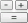
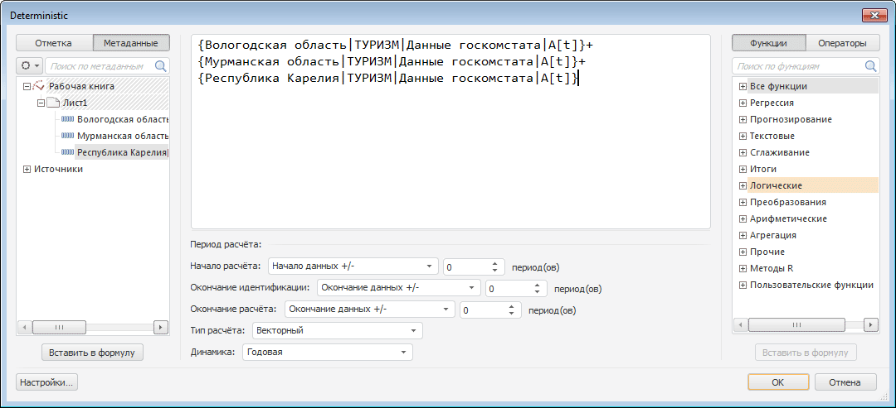
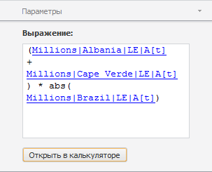

# Калькулятор

Калькулятор
-

# Калькулятор

Используется для создания вычисляемого ряда по формуле, заданной пользователем.

[Для применения
 метода](javascript:TextPopup(this))

		- В таблице данных выделите ряды, которые должны входить в
		 формулу расчёта.

		- Нажмите кнопку  «Калькулятор» на вкладке «Вычисления».

После применения метода будет отображен [редактор выражения](UiNav.Chm::/GUI/ExpressionEditor.htm),
 предназначенный для формирования формулы расчёта вычисляемого ряда. Например:

Задайте формулу расчета вычисляемого ряда. Подробнее см. раздел:
 «[Редактор
 выражения](UiNav.Chm::/GUI/ExpressionEditor.htm)».

Если формула задана верно, то при нажатии кнопки «OK»
 редактор выражения будет закрыт, в рабочую книгу будет добавлен вычисляемый
 ряд с наименованием «Deterministic»,
 содержащий результаты расчета. Дочерними рядами данного ряда будут являться
 ряды, входящие в формулу расчета.

## Настройка параметров расчёта. Вкладка «Параметры»

Для настройки параметров расчёта используйте вкладку «Параметры»
 на боковой панели. На вкладке содержится формула, по которой рассчитан
 вычисляемый ряд.

[Для отображения
 вкладки](javascript:TextPopup(this))

		- Убедитесь, что боковая панель отображается.

		- Выделите в таблице данных ряд, рассчитанный методом «Калькулятор»;

		- Установите переключатель «Ряд»
		 на боковой панели.

		- Перейдите на вкладку «Параметры».

Для редактирования формулы расчёта:

	- используйте поле «Выражение»;

	- нажмите кнопку «Открыть в калькуляторе».
	 Будет открыт [редактор
	 выражения](UiNav.Chm::/GUI/ExpressionEditor.htm).

См. также:

[Работа
 с вычисляемыми рядами](../UiDw_ComputedSeries.htm) | [Настройка параметров
 метода расчёта](UiDw_cs_common.htm) | Контейнер
 моделирования: [Детерминированное
 уравнение](UiModelling.chm::/2_Container_of_Modeling/2_3_Work_object/2_3_2_Model/Specification/4_Deterministic_equation/uimodelling_model_specification_deter.htm)

		Справочная
		 система на версию 10.9
		 от 18/08/2025,
		 © ООО «ФОРСАЙТ»,
