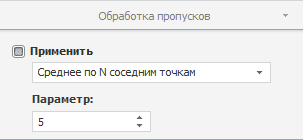

# Обработка пропусков

Обработка пропусков
-

**

# Обработка пропусков

Для выбора метода обработки пропусков, применяемого для расчёта отсутствующих
 значений переменных, используйте вкладку «Обработка
 пропусков» на боковой панели.

Примечание.
 Обработка пропусков доступна для вычисляемых рядов, рассчитанных с помощью
 [регрессионных](UiDw_cs_common.htm#regression), [прогнозных](UiDw_cs_common.htm#forecast)
 методов или методов [сглаживания](UiDw_cs_common.htm#smoothing).

[Для отображения
 вкладки](javascript:TextPopup(this))

		- Убедитесь, что боковая панель отображается.

		- Выделите в таблице данных вычисляемый ряд.

		- Установите переключатель «Ряд»
		 на боковой панели.

		- Перейдите на вкладку «Обработка
		 пропусков».

	Совет. Для быстрого
	 отображения группы вкладок «Ряд»
	 на боковой панели выполните команду «Показать
	 параметры» в контекстном меню выбранного ряда.

Если требуется обработка пропусков, то установите флажок «Применить»
 и выберите один из методов:

	- Casewise**. Используется по умолчанию. Пустые значения
	 исключаются из ряда. Расчеты ведутся без их учета;

	- **Геометрическая интерполяция**. Для вычисления пустых значений
	 ряда используется геометрическая интерполяция;

	- **Интерполяция кубическим сплайном**. Для вычисления пустых
	 значений ряда используется интерполяция кубическими сплайнами;

	- **Линейная интерполяция**. Для вычисления пустых значений
	 ряда используется линейная интерполяция по двум соседним точкам;

	- **Линейный тренд**. Для вычисления пустых значений ряда используется
	 линейный тренд;

	- **Предыдущее значение**. Пустые значения ряда заменяются
	 предыдущим непустым значением;

	- **Произвольное значение**. Пустые значения ряда заменяются
	 случайным числом из интервала [минимальное
	 значение ряда; максимальное
	 значение ряда];

	- **Следующее значение**. Пустые значения ряда заменяются следующим
	 непустым значением;

	- **Среднее значение по выборке**. Пустые значения ряда вычисляются
	 как среднее по выборке;

	- **Среднее по N соседним точкам**. Пустые значения ряда вычисляются
	 как среднее по N соседним
	 точкам. Количество соседних точек (N)
	 можно задать в поле «Параметр»;

	- **Темп роста к предыдущему периоду**. Пустые значения ряда
	 вычисляются исходя из темпа роста существующих значений к предыдущему
	 периоду. Количество периодов можно задать в поле «Параметр»;

	- **Темп роста к следующему периоду**. Пустые значения ряда
	 вычисляются исходя из темпа роста существующих значений к следующему
	 периоду. Количество периодов можно задать в поле «Параметр»;

	- Указанное значение.
	 Пустые значения ряда заменяются числом, указанным в поле «Параметр»;

	- Пользовательский. Используется
	 пользовательский метод обработки пропусков.

Примечание.
 Использование пользовательского метода обработки пропусков доступно, если
 вычисляемый ряд рассчитан с помощью [агрегации
 по показателям](Aggregation/UiDw_cs_Aggregation.htm).

Для установки пользовательского метода используйте
 язык [Fore](KeMs.chm::/Interface/IMsCrossDimensionAggregationOptions/IMsCrossDimensionAggregationOptions.FillGapsUserMethod.htm).

Если пользовательский метод был заменен на
 стандартный и изменения сохранены, то выбрать пользовательский метод обработки
 пропусков в раскрывающемся списке невозможно.

См. также:

[Работа
 с вычисляемыми рядами](../UiDw_ComputedSeries.htm) | [Методы
 обработки пропусков](Lib.chm::/03_Transformations/UiModelling_Fill_Gaps.htm) | Контейнер моделирования: модель
 «[Заполнение
 пропусков](UiModelling.chm::/2_Container_of_Modeling/2_3_Work_object/2_3_2_Model/Specification/UiModelling_Specification_Working_Lost.htm)» | [IModelling.Fill](KeMs.chm::/Interface/IModelling/IModelling.Fill.htm)

		Справочная
		 система на версию 10.9
		 от 18/08/2025,
		 © ООО «ФОРСАЙТ»,
