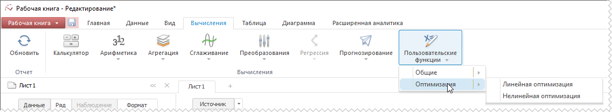
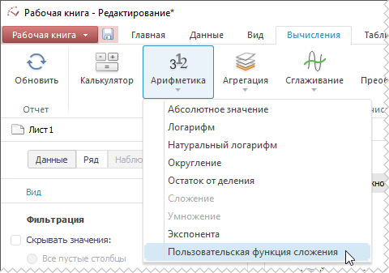
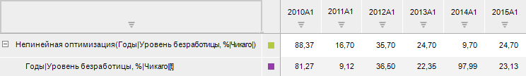

# Пользовательские функции: Рабочая книга

Пользовательские функции: Рабочая книга
-

# Пользовательские функции

Пользовательские функции и методы позволяют расширить возможности анализа
 временных рядов за счёт использования пользовательских методик расчёта.

По умолчанию пользовательские функции не подключены к инструменту «Анализ временных рядов». Для подключения
 пользовательских функций используйте вкладку «Методы»
 в разделе «Пользовательские метаданные»
 диалога «Параметры».
 Для получения подробной информации обратитесь к статье «[Подключение пользовательских
 функций](UiNav.chm::/GUI/ExpressionEditor_UserFunc.htm)».

Примечание.
 Подключение пользовательских функций доступно только в настольном приложении.

Подключенные пользовательские функции будут отображаться на вкладке
 ленты «Вычисления».

Если категория пользовательской функции отличается от категории стандартных
 методов расчёта или категория не задана, то пользовательская функция будет
 содержаться в раскрывающемся меню кнопки «Пользовательские
 функции», например:

Если категория пользовательской функции совпадает с категорией стандартного
 метода расчёта, то пользовательская функция будет содержаться в раскрывающемся
 меню кнопки, соответствующей категории стандартного метода расчёта. Например,
 пользовательская функция, имеющая категорию «Арифметика», будет содержаться
 в меню одноименной кнопки:

[Для применения
 пользовательской функции](javascript:TextPopup(this))

		- Выделите один или несколько рядов в таблице данных.

		- Выполните команду, соответствующую пользовательской функции,
		 на вкладке ленты «Вычисления».

Если пользовательская функция параметрическая, то будет отображен диалог
 «Параметры». Задайте в нём значения
 параметров функции.

После применения пользовательской функции в рабочей книге будет создан
 вычисляемый ряд с наименованием вида «Наименование_пользовательской_функции(<Имя_Ряда>)»,
 содержащий результаты расчета. Например:

См. также:

[Работа
 с вычисляемыми рядами](../UiDw_ComputedSeries.htm) | [Настройка параметров
 метода расчёта](UiDw_cs_common.htm)

		Справочная
		 система на версию 10.9
		 от 18/08/2025,
		 © ООО «ФОРСАЙТ»,
