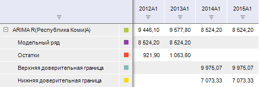

# Методы R

Методы R
-

# Методы R

Методы R позволяют создавать вычисляемые ряды с помощью пакета R.

Примечание.
 Методы R доступны, если в «Форсайт. Аналитическая платформа»
 подключен пакет R. Подробнее см. раздел: «[Как
 настроить интеграцию с R?](../../FAQ/R_Integration.htm)».

[Для применения
 метода](javascript:TextPopup(this))

		- Выделите один или несколько рядов в таблице данных.

		- Выполните команду, соответствующую названию метода в раскрывающемся
		 меню кнопки  «Методы
		 R» на вкладке ленты «Вычисления».

После применения метода в рабочей книге будет создан вычисляемый
 ряд с наименованием вида «<Название
 метода> R(<Имя_Ряда>)», содержащий результаты расчета.
 Например:

Настройка параметров расчета вычисляемого ряда, рассчитанного с помощью
 R, совпадает с настройкой одноименного метода в инструменте «Анализ
 временных рядов». Доступны следующие методы R:

	- [Линейная регрессия
	 (МНК)](Regression/UiDw_cs_LinearRegression.htm);

	- [Линейная регрессия (МИП)](Regression/UiDw_cs_TSLS.htm);

	- [Нелинейная
	 регрессия](Regression/UiDw_cs_NonLinearRegression.htm);

	- [Фильтр Бакстера-Кинга](Smoothing/UiDw_cs_BandpassFilter.htm);

	- [Фильтр
	 Ходрика-Прескотта](Smoothing/UiDw_cs_HodrickPrescottFilter.htm);

	- [Экспоненциальное
	 сглаживание](Forecast/UiDw_cs_ExponentialSmoothing.htm);

	- [Скользящее среднее](Smoothing/UiDw_cs_MovingAverage.htm);

	- [ARIMA](Forecast/UiDw_cs_ARIMA.htm).

Примечание.
 Подробная информация об особенностях работы методов R приведена в разделе:
 «[Какие
 методы в «Форсайт. Аналитическая платформа» можно рассчитать с помощью R?](uinav.chm::/FAQ/Use_of_R.htm)».

См. также:

[Настройка параметров метода расчёта](UiDw_cs_common.htm)

		Справочная
		 система на версию 10.9
		 от 18/08/2025,
		 © ООО «ФОРСАЙТ»,
