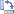
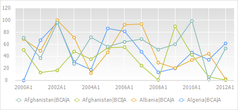
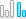
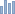
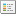
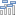
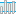

# Настройка диаграммы

Настройка диаграммы
-

# Настройка диаграммы

Диаграмма предназначена для
 графического представления данных, содержащихся в [таблице](UiDw_Series.htm).
 Например:

Ниже приведено краткое описание
 основных операций с диаграммой. Более подробное описание возможностей
 приведено в разделе «[Настройка компонентов
 диаграммы](UiDiagrams.chm::/UiDiagrams_basic_concept.htm)».

## Основные операции с диаграммой

[Выбор
 области таблицы данных, по которой строится диаграмма](javascript:TextPopup(this))

	Для выбора области таблицы данных, по которой строится диаграмма,
	 нажмите кнопку  «Данные визуализаторов», расположенную
	 на вкладке «Главная» или «Данные» ленты инструментов.
	 Будет отображено меню:

		- Вся таблица. Диаграмма
		 строится по всей таблице данных;

		- Выделенная область.
		 Диаграмма строится по данным, выделенным в таблице.

[Выбор
 рядов, отображаемых на диаграмме](javascript:TextPopup(this))

	Операция доступна, если в таблице данных выделен [вычисляемый
	 ряд](UiDw_ComputedSeries.htm).

	Для выбора отображаемых рядов нажмите кнопку  «Показать ряды», расположенную на вкладке
	 «Диаграмма» ленты инструментов.
	 В раскрывающемся меню кнопки отметьте флажками необходимые ряды. В
	 зависимости от метода расчёта возможны следующие ряды:

		- Исходный ряд. Исходные
		 данные выходной переменной;

		- Модельный ряд. Смоделированные
		 значения;

		- Прогноз. Прогнозные
		 значения, рассчитанные уравнением;

		- Остатки. Разница
		 между исходными и смоделированными данными;

		- Верхняя доверительная граница.
		 Значения верхней доверительной границы для прогнозных значений;

		- Нижняя доверительная граница.
		 Значения нижней доверительной границы для прогнозных значений.

[Скрытие/отображение
 ряда](javascript:TextPopup(this))

	Для скрытия/отображения ряда щелкните по его наименованию в легенде.

[Редактирование
 данных на диаграмме](javascript:TextPopup(this))

	Для редактирования данных ряда на диаграмме нажмите кнопку  «Разрешить редактирование»,
	 расположенную на вкладке «Диаграмма» ленты
	 инструментов. В раскрывающемся меню кнопки выберите режим редактирования:

		- по точкам. Редактирование
		 каждой точки ряда выполняется по отдельности.

		Выберите мышью ряд в легенде или на диаграмме. После этого у выбранного
		 ряда будут выделены точки, доступные для редактирования. Наведите
		 мышь на точку ряда (курсор примет вид двунаправленной стрелки),
		 зажмите кнопку мыши и переместите точку в новое положение. Текущее
		 значение точки отображается рядом с ней;

		- рисованием. Редактирование
		 нескольких точек ряда выполняется одним движением.

		Выберите мышью ряд в легенде или на диаграмме. После этого у выбранного
		 ряда будут выделены точки, доступные для редактирования. Наведите
		 мышь на точку ряда (фон ряда по оси значений будет подсвечен),
		 зажмите кнопку мыши и переместите точку в новое положение. Редактирование
		 соседних точек можно продолжить, не отпуская кнопки мыши. Текущее
		 значение редактируемой точки отображается рядом с ней.

[Исключение рядов из диаграммы с сохранением
 отметки в измерении](javascript:TextPopup(this))

	Для исключения ряда из диаграммы щёлкните по маркеру ряда в легенде
	 диаграммы. Выбранный ряд не будет отображаться в области построения
	 диаграммы, при этом:

		- ряд будет отображаться в легенде в виде маркера с подписью;

		- для элементов, соответствующих исключенному ряду, будут
		 сохранены отметки в измерении.

[Изменение
 способа передачи данных в диаграмму](javascript:TextPopup(this))

	По умолчанию данные передаются по строкам и ряды формируются из
	 данных в строках.

	Для передачи данных в диаграмму по столбцам нажмите кнопку  «Повернуть строки/столбцы»
	 на вкладке ленты инструментов «Диаграмма».
	 В результате ряды будут формироваться из данных в столбцах.

	Для возврата к передаче данных по строкам ещё раз нажмите кнопку
	  «Повернуть
	 строки/столбцы».

	Для получения примера обратитесь к разделу «[Пример
	 изменения способа передачи данных](UiDiagrams.chm::/working_with_data/rotate_data_source.htm)».

[Изменение
 типа диаграммы](javascript:TextPopup(this))

	Для изменения типа диаграммы нажмите кнопку  «Тип», расположенную на вкладке
	 «Диаграмма» или «Главная» ленты
	 инструментов. Будет отображено меню, содержащее пиктограммы, соответствующие
	 различным [типам
	 диаграмм](UiDiagrams.chm::/Type_diagrams/UiDiagrams_Type_diagrams.htm). При наведении указателя мыши на пиктограмму
	 будет отображена всплывающая подсказка с названием типа диаграммы.
	 Выберите требуемый тип диаграммы;

	Тип диаграммы также можно изменить на вкладке «[Диаграмма](UiDiagrams.chm::/Params_diagram/UiDiagrams_params_diagram.htm)» на
	 боковой панели.

[Настройка
 расположения легенды](javascript:TextPopup(this))

	Для скрытия/отображения и настройки расположения легенды используйте
	 раскрывающееся меню кнопки  «Легенда», расположенной на вкладке
	 «Диаграмма» ленты инструментов.

	Также можно использовать вкладку «[Легенда](UiDiagrams.chm::/Property_diagramm/UiDiagrams_PropertyDiagramm_legend.htm)» на боковой
	 панели.

[Отображение/скрытие
 меток](javascript:TextPopup(this))

	Метки - это подписи наблюдений
	 ряда.

	Для отображения/скрытия меток используйте раскрывающееся меню кнопки
	  «Подписи
	 данных», расположенной на вкладке «Диаграмма» ленты
	 инструментов.

[Настройка
 формата компонента диаграммы](javascript:TextPopup(this))

	Примечание.
	 Возможность доступна только в настольном приложении.

	Для настройки компонента диаграммы дважды щелкните по нему мышью.
	 Будет отображен диалог настройки формата, соответствующий компоненту.

	Подробное описание параметров формата компонентов диаграммы приведено
	 в разделе «[Настройка
	 компонентов диаграмм](UiDiagrams.chm::/UiDiagrams_basic_concept.htm)».

[Отображение
 коридоров диаграммы](javascript:TextPopup(this))

	Для автоматического построения коридоров на диаграмме вычисляемого
	 ряда нажмите кнопку  «Коридоры диаграмм», расположенную
	 на вкладке «Диаграмма» ленты
	 инструментов. Коридор будет добавлен между прогнозным рядом и доверительными
	 границами.

	Примечание.
	 Коридор отображается, если прогнозный ряд и ряды доверительных границ
	 присутствуют на диаграмме.

	Для добавления коридора вручную и настройки существующих коридоров
	 выполните команду «Коридоры диаграммы»
	 в контекстном меню диаграммы. Будет отображен диалог «[Коридоры
	 диаграммы](UiDiagrams.chm::/uidiagrams_corridors.htm)», в котором выполните необходимые
	 действия.

См. также:

[Описание
 интерфейса анализа временных рядов](../Purpose/UiDw_Purpose_Basic_Window.htm)

		Справочная
		 система на версию 10.9
		 от 18/08/2025,
		 © ООО «ФОРСАЙТ»,
