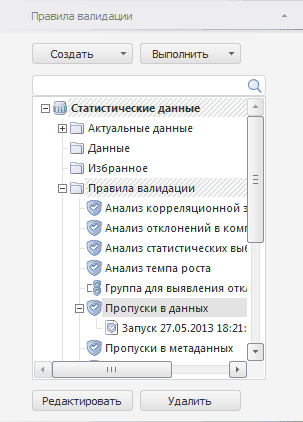

# Валидация данных

Валидация данных
-

# Валидация данных

Валидация - это проверка данных временных рядов и [стандартного
 куба](UiNavObj.chm::/Cube/CreateCube/Master_Standart/UiMd_Cube_CreateCube_Master_Standart.htm) на соответствие заданным условиям и ограничениям.

Примечание.
 Валидация данных недоступна при работе с [глобальным кешем](UiNav.chm::/02_Navigator/Cache_In_Blob.htm).

В инструменте анализа временных рядов валидация данных выполняется с
 помощью правил валидации. Для последовательного выполнения нескольких
 правил валидации они могут быть объединены в группу.

Все правила и группы правил валидации отображаются на вкладке «Правила валидации».

[Для отображения
 вкладки](javascript:TextPopup(this))

		- Убедитесь, что боковая панель отображается.

		- Установите переключатель «Данные»
		 на боковой панели.

		- Перейдите на вкладку «Правила
		 валидации».

## Основные операции с правилами/группами правил валидации

[Создание
 правила валидации](javascript:TextPopup(this))

	Для создания правила:

		- с сохранением в БД временных
		 рядов:

		-

			- нажмите кнопку «Создать > Правило
			 валидации» на вкладке «Правила
			 валидации» на боковой панели;

			- выполните команду «Создать > Правило
			 валидации» в контекстном меню объекта репозитория на
			 вкладке боковой панели «Правила
			 валидации».

	Будет открыт диалог «[Правило
	 валидации](UiValidation.chm::/Data_Validation_Types.htm)». Созданное правило будет сохранено в
	 БД временных рядов, но не будет выполнено.

		- без сохранения в БД временных
		 рядов. Нажмите кнопку 
		 «Валидация» на вкладке
		 «Расширенная аналитика»
		 ленты инструментов. Будет открыт диалог «[Правило
		 валидации](UiValidation.chm::/Data_Validation_Types.htm)». Созданное правило будет выполнено,
		 но не будет сохранено в БД временных рядов.

[Настройка
 параметров правила валидации](javascript:TextPopup(this))

	Используйте вкладку боковой панели «Правила
	 валидации». Для настройки параметров выбранного правила валидации:

		- нажмите кнопку «Редактировать»;

		- выполните команду «Редактировать»
		 в контекстном меню правила;

		- дважды щелкните по правилу валидации;

		- нажмите клавишу F4. Возможность доступна только в настольном
		 приложении.

	Будет открыт диалог «[Правило
	 валидации](UiValidation.chm::/Data_Validation_Types.htm)».

	Совет. Для настройки
	 параметров правила валидации можно использовать навигатор объектов:
	 выделите правило и дважды по нему щелкните или выполните команду «Редактировать» в контекстном меню
	 правила.

[Создание
 группы правил валидации](javascript:TextPopup(this))

	Используйте вкладку «Правила валидации»
	 на боковой панели:

		- нажмите кнопку «Создать > Группа
		 правил валидации»;

		- выполните команду «Создать > Группа
		 правил валидации» в контекстном меню объекта репозитория
		 на вкладке боковой панели.

	Будет открыт диалог «[Группа
	 правил валидации](UiValidation.chm::/Grouping_types.htm)».

[Редактирование
 группы правил валидации](javascript:TextPopup(this))

	Используйте вкладку боковой панели «Правила
	 валидации». Для настройки параметров выбранной группы правил
	 валидации:

		- нажмите кнопку «Редактировать»;

		- выполните команду «Редактировать»
		 в контекстном меню группы;

		- дважды щелкните по группе правил валидации;

		- нажмите клавишу F4. Возможность доступна только в настольном
		 приложении.

	Будет открыт [диалог для редактирования](UiValidation.chm::/Grouping_types.htm) выбранной группы.

	Совет. Для редактирования
	 группы правил валидации можно использовать навигатор объектов: выделите
	 группу правил валидации и дважды по ней щелкните или выполните команду
	 «Редактировать» в контекстном
	 меню группы.

[Выполнение
 правила/группы правил](javascript:TextPopup(this))

	Правило/группа правил валидации может быть выполнена:

		- на текущем листе;

		- в текущей рабочей книге;

		- в текущей базе данных временных рядов.

	Для выполнения правила/группы правил валидации используйте вкладку
	 боковой панели «Правила валидации»:

		- Выберите правило/группу правил.

		- Нажмите кнопку «Выполнить»
		 или выполните одноименную команду в контекстном меню.

		- В отобразившемся меню укажите
		 область выполнения валидации.

	Валидация данных будет выполнена в указанной области.

	Совет. Для выполнения
	 правила/группы правил на текущем листе рабочей книги перетащите правило/группу
	 правил на требуемый лист.

	В настольном приложении доступно выполнение правила/группы правил
	 валидации с помощью ленты инструментов:

		- Перейдите на вкладку «Расширенная
		 аналитика» на ленте инструментов.

		- В раскрывающемся меню кнопки  «Валидация»
		 в группе «Правила источника данных»
		 выберите требуемое правило валидации.

	Валидация данных будет выполнена на текущем листе рабочей книги.

[Выполнение
 готовых правил валидации](javascript:TextPopup(this))

	Готовые правила валидации присутствуют в рабочей книге по умолчанию
	 и требуют задания минимальных настроек или выполняются с предустановленными
	 настройками.

	Для выполнения готового правила валидации используйте вкладку «Расширенная аналитика» на ленте
	 инструментов. В раскрывающемся меню кнопки  «Валидация» выберите требуемое правило
	 валидации. В настольном приложении готовые правила валидации в меню объединены
	 в соответствующую группу.

	Готовые правила валидации данных:

		- выполняются с предустановленными настройками:

		-

			- Пропуски в данных.
			 Выявляет пропущенные значения во всех данных;

		- требуют задания минимальных настроек:

		-

			- [Сравнение с числом](UiValidation.chm::/Fast_Validation/FastVLA_ComparisonValue.htm).
			 Сравнивает значения с заданным числом;

			- [Анализ статистических выбросов](UiValidation.chm::/Fast_Validation/FastVLA_Statistical_outlier.htm).
			 Выявляет статистические выбросы в данных;

			- [Сравнение версий данных](UiValidation.chm::/Fast_Validation/FastVLA_RevisionComparison.htm).
			 Сравнивает текущую и указанную версии значений временных рядов.
			 Актуально, если ряды хранятся в [версионной](UiNavObj.chm::/TimeSeriesDatabase/TS_Attributes.htm)
			 БД временных рядов.

	Готовое правило будет выполнено на текущем листе рабочей книги.

[Работа с результатами
 валидации](javascript:TextPopup(this))

	Если валидация выполнялась:

		- на текущем листе или в текущей рабочей книге, то результаты
		 будут отображены в области выполнения валидации;

		- в текущей БД временных рядов, то в открытой рабочей книге
		 будет создан лист, содержащий результаты валидации. Также результаты
		 будут сохранены в виде дочернего объекта для правила/группы правил
		 валидации.

	Для [работы
	 с результатами валидации](UiValidation.chm::/Calculation_result.htm) используйте вкладку «Расширенная
	 аналитика» на ленте инструментов и вкладку «Исключения»
	 на боковой панели.

[Удаление правила/группы
 правил валидации](javascript:TextPopup(this))

	Для удаления правила/группы правил, выделенной на вкладке боковой
	 панели «Правила валидации»:

		- нажмите кнопку «Удалить»;

		- выполните команду «Удалить»
		 в контекстном меню;

		- нажмите сочетание клавиш CTRL+DELETE.
		 Возможность доступна только в настольном приложении.

	Будет запрошено подтверждение выполняемого действия.

[Структурирование
 правил/групп правил валидации](javascript:TextPopup(this))

	Для перемещения правил/группы правил валидации:

		- Выделите правило/группу правил на вкладке боковой панели
		 «Правила валидации».

		- Выполните необходимую команду «Копировать»,
		 «Вырезать», «Вставить»
		 в контекстном меню.

	Для создания папки, в которой могут храниться правила/группы правил
	 валидации:

		- Перейдите на вкладку «Правила
		 валидации» на боковой панели.

		- Выделите элемент, внутри которого должна быть создана папка.

		- Нажмите кнопку «Создать > Папку»
		 или выполните одноименную команду в контекстном меню.

	Папка будет создана внутри выделенного элемента.

[Поиск правила/группы
 правил валидации](javascript:TextPopup(this))

	Для поиска правила/группы правил валидации используйте строку поиска,
	 расположенную в верхней части вкладки «Правила
	 валидации» на боковой панели. Введите наименование искомого
	 правила/группы правил в строку поиска. На вкладке останутся лишь правила/группы
	 правил, соответствующие условиям поиска.

	Для сброса результатов поиска очистите строку поиска.

[Переименование
 правила/группы правил валидации](javascript:TextPopup(this))

	Для переименования правила/группы правил, выделенной на вкладке
	 боковой панели «Правила валидации»:

		- выполните команду «Переименовать»
		 в контекстном меню;

		- щелкните по выделенному правилу/группе правил;

		- нажмите клавишу F2. Возможность доступна только в
		 настольном приложении.

	Название правила/группы правил будет переведено в режим редактирования.
	 Для завершения редактирования нажмите клавишу ENTER.

См. также:

[Настройка
 правила валидации](UiValidation.chm::/Data_Validation_Types.htm)

		Справочная
		 система на версию 10.9
		 от 18/08/2025,
		 © ООО «ФОРСАЙТ»,
